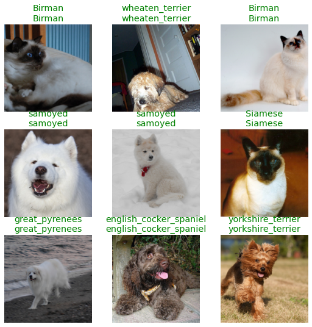
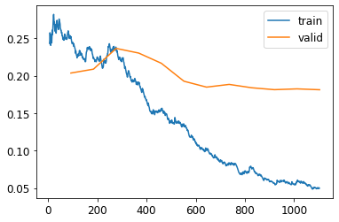

## <span style="color:#FF9F1D">About Fastbook</span>

Fastbook is a book is focused on the practical side of deep learning. It starts with the big picture, such as definitions and general applications of deep learning, and progressively digs beneath the surface into concrete examples.

The book is based on *fastai* API, an API on top of Pytorch that makes it easier to use state-of-the-art methods in deep learning.

The early chapters contain the basics of deep learning, so I skimmed them and started to make notes on the fifth chapter. It doesn't need you to understand models such as Convolutional Neural Networks and how they work, but it definitely helped me following the book.

I used Google Colab notebooks as it provides free GPU. The downside is that it doesn't have any memory available so you will have to install fastai every time you run a notebook. The fastbook package includes fastai and several easy-access datasets to test the models.

## <span style="color:#FF9F1D">Installing fastai in Google Colab</span>

```python
!pip install -Uqq fastbook

     |████████████████████████████████| 727kB 29.0MB/s
     |████████████████████████████████| 1.2MB 45.6MB/s
     |████████████████████████████████| 194kB 47.3MB/s
     |████████████████████████████████| 51kB 7.9MB/s
     |████████████████████████████████| 61kB 9.2MB/s
     |████████████████████████████████| 61kB 9.0MB/s

```


```python
import fastbook
fastbook.setup_book()
from fastai.vision.all import *
from fastai.vision import *
```

# <span style="color:#637ccf">Fastbook Notes - Chapter 5: Image Classification</span>

This chapter focused on building an image classification model.

## <span style="color:#FF9F1D">Oxford-IIIT Pet Dataset</span>

We will use a images dataset with 37 pet breeds classes and roughly 200 images for each class. The images have large variations in scale, pose, and lighting (here the [original source](https://www.robots.ox.ac.uk/~vgg/data/pets/)).

```python
# Downloading the Oxford-IIIT Pet Dataset
path = untar_data(URLs.PETS)
```

We can use the `ls` method from fastai to see what is in our dataset and folders

```python
Path.BASE_PATH = path
print(path.ls())
(path/"images").ls()


    [Path('annotations'), Path('images')]

    (#7393) [Path('images/newfoundland_31.jpg'),Path('images/Ragdoll_79.jpg'),Path('images/yorkshire_terrier_31.jpg'),Path('images/havanese_172.jpg'),Path('images/newfoundland_61.jpg'),Path('images/Abyssinian_175.jpg'),Path('images/leonberger_164.jpg'),Path('images/saint_bernard_86.jpg'),Path('images/boxer_108.jpg'),Path('images/scottish_terrier_195.jpg')...]
```

## <span style="color:#FF9F1D">DataBlocks</span>

Fastai uses DataBlocks to load the data. Here we load the images of the folder into this `DataBlock`. Most of the arguments of the functions are quite intuitive to guess, but they are explained below in any case.

{}
- `DataBlock` is the envelope of the structure of the data. Here you tell fastai API how you organized the data.

- `blocks` is how you tell fastai what inputs are images (`ImageBlock`) and what are the targets for the categories (`CategoryBlock`).

- `get_items` is how you tell fastai to assemble our items inside the `DataBlock`.

- `splitter` is used to divide the images in training and validation set randomly.

- `get_y` is used to create target values. The images are not labeled, they are just 7393 jpgs. We extract the target label (y) from the name of the file using regex expressions `RegexLabeller`.
{}


```python
pets = DataBlock(blocks = (ImageBlock, CategoryBlock),
                 get_items=get_image_files,
                 splitter=RandomSplitter(seed=42),
                 get_y=using_attr(RegexLabeller(r'(.+)_\d+.jpg$'), 'name'),
                 item_tfms=Resize(460),
                 batch_tfms=aug_transforms(size=224, min_scale=0.75))

# Tell DataBlock where the "source" is
dls = pets.dataloaders(path/"images")
```
We can take the first image and print the path using `.ls()` method as well.

```python
fname = (path/"images").ls()[0]
fname


    /root/.fastai/data/oxford-iiit-pet/images/newfoundland_31.jpg
```

Using regex we can extract the target from the jpg name

```python
re.findall(r'(.+)_\d+.jpg$', fname.name)

          ['newfoundland']
```


The last 2 methods are about data augmentation strategy, what fastai call *presizing*.

**Presizing** is a particular way to do image augmentation that is designed to speed up computation and improve model accuracy.

{}
- `item_tfms` resize so all the images have the same dimension (In this case 460x460). It is needed so they can collate into tensors to be passed to the GPU. By default, it crops the image (not squish like when you set the background of your computer screen). On the training set, the crop area is chosen randomly. On the validation set, the center square of the image is always chosen.

- `batch_tfms` randomly random crops and augment parts of the images. It's only done once, in one batch. On the validation set, it only resizes to the final size needed for the model. On the training set, it first random crops and performs any augmentations, and then it resizes.

- `aug_transforms` function can be used to create a list of images flipped, rotated, zoomed, wrapped, or with changed lighting. It helps the training process and avoids overfitting. `min_scale` determines how much of the image to select at minimum each time (More [here](https://docs.fast.ai/vision.augment.html#aug_transforms))
{}


## <span style="color:#FF9F1D">Other resizing methods</span>

With `show_batch` we can print a batch of images of the training set.

```python
# Show some images
dls.show_batch(max_n=6)
```


We can squish the images, or add padding to the sides or crop it by copying the model with `.new` method and modifying the part of the model that you want to change.

Here we squish the images:


```python
pets = pets.new(item_tfms= Resize(256, ResizeMethod.Squish))
dls = pets.dataloaders(path/"images")
dls.show_batch(max_n=6)
```


Here we add padding to the images:

```python
pets = pets.new(item_tfms= Resize(256, ResizeMethod.Pad, pad_mode='zeros'))
dls = pets.dataloaders(path/"images")
dls.show_batch(max_n=6)
```


**Remember that by cropping the images we removed some of the features that allow us to perform recognition.**

Instead, what we normally do in practice is to randomly select part of the image and crop it. On each epoch (which is one complete pass through all of our images in the dataset) we randomly select a different crop of each image. We can use `RandomResizedCrop` for that.

This means that our model can learn to focus on, and recognize, different features in our images at different epochs. It also reflects how images work in the real world as different photos of the same thing may be framed in slightly different ways.


```python
pets = pets.new(item_tfms= RandomResizedCrop(128, min_scale=0.3))
dls = pets.dataloaders(path/"images")
# Unique=True to have the same image repeated with different versions of this RandomResizedCrop transform
dls.show_batch(max_n=6, unique=True)
```


We can alwasy use `new` method to get back to the first resizing method chosen (`aug_transforms`):


```python
pets = pets.new(item_tfms=Resize(460), batch_tfms=aug_transforms(size=224, min_scale=0.75))
dls = pets.dataloaders(path/"images")
dls.show_batch(max_n=6, unique = True)
```


## <span style="color:#FF9F1D">Creating a baseline model</span>

We can see the shape of the data by printing one batch. Here we printed the labels `y`. There are 64 listed numbers printed as the batch size is 64. The range of the numbers goes from 0 to 36 as it represents the labels for the 37 pet breeds.


```python
x, y = dls.one_batch()
y

    TensorCategory([ 9,  1,  2, 22, 14, 35, 27, 28, 17, 31,  0,  9, 13, 12,  0, 12, 15, 36,  2,
    13,  9,  1, 14, 11, 33, 29,  7, 27, 13, 10,  4, 30, 5, 24, 20, 32, 14,  8, 18, 35, 15,
    23, 11, 24, 21, 22,  9, 18, 9, 17, 12, 15, 14, 17, 36, 18, 18, 33, 21,  0, 10, 17, 12,  7]
    , device='cuda:0')
```

Training a powerful baseline model requires 2 lines of code:


```python
learn = cnn_learner(dls, resnet34, metrics= error_rate)
learn.fine_tune(2)
```

{}
- `dls` is our data.
- `restnet34` is a certain pre-trained CNN architecture.
- The `metric` requested is `error_rate`.
- By default, fast ai chooses the loss function that best fit our kind of data. With image data and a categorical outcome, fastai will default to using `cross-entropy loss`.
- `fine_tune(2)` indicates the number of epochs with the default model configuration.
{}
This is the magic and simplicity of fastai. Once you have the data correctly loaded, the modeling with pre-trained models cannot be easier. Fastai automatically download the pre-trained architecture, choses an appropiate loss funtion and prints the metric results:


<table border="0" class="dataframe">
  <thead>
    <tr style="text-align: left;">
      <th>epoch</th>
      <th>train_loss</th>
      <th>valid_loss</th>
      <th>error_rate</th>
      <th>time</th>
    </tr>
  </thead>
  <tbody>
    <tr>
      <td>0</td>
      <td>1.532038</td>
      <td>0.331124</td>
      <td>0.112991</td>
      <td>01:07</td>
    </tr>
  </tbody>
</table>


<table border="0" class="dataframe">
  <thead>
    <tr style="text-align: left;">
      <th>epoch</th>
      <th>train_loss</th>
      <th>valid_loss</th>
      <th>error_rate</th>
      <th>time</th>
    </tr>
  </thead>
  <tbody>
    <tr>
      <td>0</td>
      <td>0.514930</td>
      <td>0.295484</td>
      <td>0.094046</td>
      <td>01:12</td>
    </tr>
    <tr>
      <td>1</td>
      <td>0.330700</td>
      <td>0.223524</td>
      <td>0.071042</td>
      <td>01:12</td>
    </tr>
  </tbody>
</table>


The second column show the cross-entropy loss in the training and validation set. The fourth column show less than 1% of error classifying the images.

It even includes handy shortcuts like `show_results` to print the real and predicted labels for a quick check test of labels and predictions:

```python
learn.show_results()
```




## <span style="color:#FF9F1D">Model interpretation</span>

After building a model, you don't want to know only how many targets got right. You might want to know which targets are harder to predict or which images got wrong to train it better. fastai includes a `ClassificationInterpretation` class from which you can call `plot_confusion_matrix`,  `most_confused` or `plot_top_losses` methods to extract this information easily.


```python
interp = ClassificationInterpretation.from_learner(learn)
interp.plot_confusion_matrix(figsize = (12,12), dpi=60)
```


We can see which are the labels that the model more struggles to differentiate:


```python
interp.most_confused(min_val = 4)

    [('american_pit_bull_terrier', 'american_bulldog', 6),
     ('British_Shorthair', 'Russian_Blue', 5),
     ('Ragdoll', 'Birman', 5),
     ('Siamese', 'Birman', 4),
     ('american_pit_bull_terrier', 'staffordshire_bull_terrier', 4),
     ('chihuahua', 'miniature_pinscher', 4),
     ('staffordshire_bull_terrier', 'american_pit_bull_terrier', 4)]
```

And the the most "wrong" predictions:

```python
interp.plot_top_losses(5, nrows = 5)
```


## <span style="color:#FF9F1D">Exporting and importing a model</span>

Models with multiple layers, epochs, and parameters can take hours to train. Instead of starting over every time you run the notebook, the model can be saved and loaded again.

**Saving/Exporting a model**:

```python
learn.export(os.path.abspath('./my_export.pkl'))
```

To check that the model is saved, you can either navigate the folder and see the `.pkl`, or also you can call the `path.ls()` method and see the file printed.

**Loading/Importing a model**:

```python
learn_inf = load_learner('my_export.pkl')
```
## <span style="color:#FF9F1D">Testing the model outside the fastai environment</span>

To see if the model would work outside the dataloader environment, I googled "Bengal cat" in google and drag a random image into the Google Colab folder. I consider the image as tricky, as it contains a human holding a Bengal cat:


I simply called the `predict` method of the model trained before to see if it is as easy at it looks to use fastai.

```python
learn_inf.predict('test_image.jpg')
```


    ('Bengal',
     tensor(1),
     tensor([9.6365e-07, 9.9558e-01, 5.0118e-09, 2.5665e-08, 5.0663e-08, 4.2385e-03, 1.6677e-04, 1.0780e-08, 3.7194e-08, 1.1227e-07, 7.4500e-09, 3.3078e-06, 4.6680e-08, 8.1986e-07, 1.0533e-07, 8.3078e-08,
             9.4154e-08, 2.7704e-08, 2.7787e-07, 2.6699e-06, 2.5465e-06, 7.7660e-09, 8.5412e-09, 1.5087e-07, 3.9640e-08, 3.1239e-08, 9.4404e-07, 3.2094e-08, 5.2541e-08, 7.1558e-09, 4.6352e-09, 1.7388e-08,
             6.1503e-08, 6.6123e-08, 7.2059e-09, 9.4673e-08, 5.6627e-07]))


Surprisingly, it got the label of the image right. Loading the training data was less than 10 lines of code and the model itself is 1 line. It could handle random animal images and classify them regardless of the input image size, image format, or anything else.

## <span style="color:#FF9F1D">Improving Our Model</span>


The one-line-of-code model is great, but we might want to tweak the model and compare the results to increase the accuracy. We will explore 4 techniques or tools that can improve the model:

1. Learning rate finder
2. Transfer Learning
3. Discriminative Learning rates
4. Selecting the right number of epochs


##### Learning rate finder

The general idea of a *learning rate finder* is to start with a very very small learning rates, watch the loss function, and iterating with bigger and bigger learning rates.

We start with some number so small that we would never expect it to be too big to handle, like .00000007. We use that for one mini-batch, track the loss, and double the learning rate. We keep doing it until the loss gets worse. Once it started to get worse and worse, we should select a learning rate a bit lower than that point.

fastai method `lr_find()` does all this loop for us:

```python
learn = cnn_learner(dls, resnet34, metrics = error_rate)
learn.lr_find()
```

    SuggestedLRs(valley=tensor(0.0025))


```python
# Let's call it the "leslie_smith_lr" in honor to the author of the orignal paper
leslie_smith_lr = 0.0025
learn = cnn_learner(dls, resnet34, metrics = error_rate)
learn.fine_tune(2, base_lr = leslie_smith_lr)
```


<table class="dataframe">
  <thead>
    <tr style="text-align: left;">
      <th>epoch</th>
      <th>train_loss</th>
      <th>valid_loss</th>
      <th>error_rate</th>
      <th>time</th>
    </tr>
  </thead>
  <tbody>
    <tr>
      <td>0</td>
      <td>1.261431</td>
      <td>0.310061</td>
      <td>0.102842</td>
      <td>01:10</td>
    </tr>
  </tbody>
</table>


<table class="dataframe">
  <thead>
    <tr style="text-align: left;">
      <th>epoch</th>
      <th>train_loss</th>
      <th>valid_loss</th>
      <th>error_rate</th>
      <th>time</th>
    </tr>
  </thead>
  <tbody>
    <tr>
      <td>0</td>
      <td>0.547525</td>
      <td>0.373586</td>
      <td>0.115020</td>
      <td>01:14</td>
    </tr>
    <tr>
      <td>1</td>
      <td>0.348811</td>
      <td>0.226233</td>
      <td>0.068336</td>
      <td>01:14</td>
    </tr>
  </tbody>
</table>

Compared with the baseline model we reduced slightly the error_rate. In the next tables, I will keep track of the improvements and the comparison of the methods.

##### Transfer Learning and Freezing

**Transfer learning**

The last layer in a CNN is the classification task. This pet breed classification task is a layer with 37 neurons with a softmax function that gives the probability of the image for each of the  37 classes. But how can we use all this hard-consuming weighting parametrization in another image classification task? We start all over? **No!**

We can take the model, ditch the last layer and substitute it for our new classification task. For example, for a layer with 5 neurons that classify images into 5 different classes. That it's the idea behind **transfer learning**, taking the parameters and model from one task and substituting the last layer for the new task without starting the weighting from scratch. It saves time and also produces better results. `restnet34` is an example of this, as it is a pre-trained model with its custom parametrization.

**Freezing**

Transfer learning can be applied by a technique called freezing. By freezing you tell the model not to touch certain layers. They are "frozen".

*Why you would want to freeze layers?*

To focus on the layer that matters. As I said, `restnet34` is already trained beforehand. We can tell the model to focus more on the last layer, our classification task, and keep the former ones untouched. Freeze and unfreeze effectively allow you to decide which specific layers of your model you want to train at a given time.

Freezing is especially handy when you want to focus not only on the weighting but also on some parameters like the learning rate.

To allow transfer learning we can use `fit_one_cycle` method, instead of `fine_tune`. Here we load the model with our data and train it for 3 epochs:


```python
learn = cnn_learner(dls, resnet34, metrics = error_rate)
learn.fit_one_cycle(3, leslie_smith_lr)
```


<table class="dataframe">
  <thead>
    <tr style="text-align: left;">
      <th>epoch</th>
      <th>train_loss</th>
      <th>valid_loss</th>
      <th>error_rate</th>
      <th>time</th>
    </tr>
  </thead>
  <tbody>
    <tr>
      <td>0</td>
      <td>1.220214</td>
      <td>0.328361</td>
      <td>0.103518</td>
      <td>01:13</td>
    </tr>
    <tr>
      <td>1</td>
      <td>0.559653</td>
      <td>0.242575</td>
      <td>0.080514</td>
      <td>01:11</td>
    </tr>
    <tr>
      <td>2</td>
      <td>0.340312</td>
      <td>0.220747</td>
      <td>0.069689</td>
      <td>01:11</td>
    </tr>
  </tbody>
</table>


Consider this model parametrization "froze". Using `unfreeze()` method allows the model to start over from the already weighting from `fit_one_cyle`, so it doesn't start from random weighting but the "frozen" parameters from the 3 first epochs of `fit_one_cyle`.


```python
learn.unfreeze()
```

It is is easier for the model to start from a pre-trained weighting than with random weighting. To illustrate this point let's try to search for an optimal learning rate again:


```python
learn.lr_find()
```
    SuggestedLRs(valley=4.365158383734524e-05)


In this graph, the Loss axis is way smaller than the previous one. The model is already trained beforehand and therefore trying mini-batches of different learning rates and iterating is easier.

To apply "transfer learning" we train the model with another 6 epochs that will start from the previous parametrization. We use the new learning rate as well.


```python
leslie_smith_lr_2 = 4.365158383734524e-05
learn.fit_one_cycle(6, leslie_smith_lr_2)
```

Instead of printing the epoch results, from here on I'll show the results of the last epoch and the comparison with the other models:

<table class="dataframe">
  <thead>
    <tr style="text-align: left;">
      <th>Model</th>
      <th>Train Loss</th>
      <th>Validation Loss</th>
      <th>Error rate</th>
    </tr>
  </thead>
  <tbody>
    <tr>
      <td>ResNet-34 Baseline (2 epochs)</td>
      <td>0.330700</td>
      <td>0.223524</td>
      <td>0.071042</td>
    </tr>
    <tr>
      <td>ResNet-34 with Learning rate finder (2 epochs)</td>
      <td>0.348811</td>
      <td>0.226233</td>
      <td>0.068336</td>
    </tr>
    <tr>
      <td><b>ResNet-34 with Transfer Learning (6 epochs)</b></td>
      <td><b>0.534172</b></td>
      <td><b>0.261891</b></td>
      <td><b>0.083897</b></td>
    </tr>
  </tbody>
</table>


### Discriminative learning rates

Even after we unfreeze, we still care a lot about the quality of those pre-trained weights. We would not expect that the best learning rate for those pre-trained parameters would be as high as for the randomly added parameters, even after we have tuned those randomly added parameters for a few epochs

Like many good ideas in deep learning, the idea of ***Discriminative learning rates*** is extremely simple: use a lower learning rate for the early layers of the neural network,
and a higher learning rate for the later layers

The first layer learns very simple foundations, like image edges and gradient detectors; these are likely to be just as useful for nearly any task. The later layers learn much more complex concepts, like the concept of “eye” and “sunset,” which might not be useful in your task at all (maybe you’re classifying car models, for instance). So it makes sense to let the later layers fine-tune more quickly than earlier layers.

By default, fastai `cnn_learner` uses discriminative learning rates.

Let’s use this approach to replicate the previous training, but this time:

The first value passed will be the learning rate in the earliest layer of the neural network, and the second value will be the learning rate in the final layer. The layers in between will have learning rates that are multiplicatively equidistant throughout that range.

Let’s use this approach to replicate the previous training, but this time we’ll set only the lowest layer of our network to a learning rate of 4e-6; the other layers will scale up to 4e-4.


```python
# Model
learn = cnn_learner(dls, resnet34, metrics = error_rate)
# Pre-train the model
learn.fit_one_cycle(3, leslie_smith_lr)
learn.unfreeze()
# Train the model with a learning rate range
learn.fit_one_cycle(12, lr_max=slice(4e-6,4e-4))
```


<table class="dataframe">
  <thead>
    <tr style="text-align: left;">
      <th>Model</th>
      <th>Train Loss</th>
      <th>Validation Loss</th>
      <th>Error rate</th>
    </tr>
  </thead>
  <tbody>
    <tr>
      <td>ResNet-34 Baseline (2 epochs)</td>
      <td>0.330700</td>
      <td>0.223524</td>
      <td>0.071042</td>
    </tr>
    <tr>
      <td>ResNet-34 with Learning rate Finder (2 epochs)</td>
      <td>0.348811</td>
      <td>0.226233</td>
      <td>0.068336</td>
    </tr>
    <tr>
      <td>ResNet-34 with Transfer Learning (6 epochs)</td>
      <td>0.534172</td>
      <td>0.261891</td>
      <td>0.083897</td>
    </tr>
      <td><b>ResNet-34 with Discriminative learning rates (12 epochs)</b></td>
      <td><b>0.049675</b></td>
      <td><b>0.181254</b></td>
      <td><b>0.048714</b></td>
    </tr>
  </tbody>
</table>


### Selecting the Number of Epochs

The more epochs, the more time and tries the model has to learn the trained data. Your first approach to training should be to simply pick a specific number of epochs that you are happy to wait for, and look at the training and validation loss plots.

Using `.plot_loss()` you can see if the validation loss keeps getting better with more epochs. If not, it is a waste of time to use more than the necessary epochs.

For some machine learning problems is worth keep training the model for a day to earn 1% more accuracy, such as programming competitions, but in most cases choosing the right model or better parametrization is going to be more important than squishing the last marginal accuracy point with 300 more epochs.

```python
learn.recorder.plot_loss()
```




### Deeper Architectures

In general, a model with more parameters can describe your data more accurately. A larger version of a ResNet will always be able to give us a better training loss, but it can suffer more from overfitting, basically because it has more parameters to suffer from overfitting.

Another downside of deeper architectures is that they take quite a bit longer to
train. One technique that can speed things up a lot is **mixed-precision training**. This
refers to using less-precise numbers (half-precision floating point, also called fp16)
where possible during training.

Instead of using `.fit_one_cycle()` and then `unfreeze()` methods we tell fastai how many epochs to freeze with `freeze_epochs` since we are not changing the learning rates from one step to the other like in Discriminative learning rates.


```python
from fastai.callback.fp16 import *
learn = cnn_learner(dls, resnet50, metrics=error_rate).to_fp16()
learn.fine_tune(6, freeze_epochs=3)
```

<table class="dataframe">
  <thead>
    <tr style="text-align: left;">
      <th>epoch</th>
      <th>train_loss</th>
      <th>valid_loss</th>
      <th>error_rate</th>
      <th>time</th>
    </tr>
  </thead>
  <tbody>
    <tr>
      <td>0</td>
      <td>1.260760</td>
      <td>0.327534</td>
      <td>0.095399</td>
      <td>01:07</td>
    </tr>
    <tr>
      <td>1</td>
      <td>0.595598</td>
      <td>0.297897</td>
      <td>0.089310</td>
      <td>01:07</td>
    </tr>
    <tr>
      <td>2</td>
      <td>0.431712</td>
      <td>0.256303</td>
      <td>0.089986</td>
      <td>01:07</td>
    </tr>
  </tbody>
</table>


<table class="dataframe">
  <thead>
    <tr style="text-align: left;">
      <th>epoch</th>
      <th>train_loss</th>
      <th>valid_loss</th>
      <th>error_rate</th>
      <th>time</th>
    </tr>
  </thead>
  <tbody>
    <tr>
      <td>0</td>
      <td>0.286988</td>
      <td>0.246470</td>
      <td>0.079161</td>
      <td>01:09</td>
    </tr>
    <tr>
      <td>1</td>
      <td>0.323408</td>
      <td>0.258964</td>
      <td>0.091340</td>
      <td>01:08</td>
    </tr>
    <tr>
      <td>2</td>
      <td>0.262799</td>
      <td>0.315306</td>
      <td>0.083221</td>
      <td>01:09</td>
    </tr>
    <tr>
      <td>3</td>
      <td>0.167648</td>
      <td>0.242762</td>
      <td>0.073072</td>
      <td>01:09</td>
    </tr>
    <tr>
      <td>4</td>
      <td>0.090543</td>
      <td>0.180670</td>
      <td>0.056834</td>
      <td>01:09</td>
    </tr>
    <tr>
      <td>5</td>
      <td>0.060775</td>
      <td>0.174947</td>
      <td>0.050068</td>
      <td>01:09</td>
    </tr>
  </tbody>
</table>


### Final comparison of models

Based on the validation loss and the error rate, a deeper and more complex architecture(RestNet50) and the model with discriminative learning rates hold the best results.


<table class="dataframe">
  <thead>
    <tr style="text-align: left;">
      <th>Model</th>
      <th>Train Loss</th>
      <th>Validation Loss</th>
      <th>Error rate</th>
    </tr>
  </thead>
  <tbody>
    <tr>
      <td>ResNet-34 Baseline (2 epochs)</td>
      <td>0.330700</td>
      <td>0.223524</td>
      <td>0.071042</td>
    </tr>
    <tr>
      <td>ResNet-34 with Learning rate Finder (2 epochs)</td>
      <td>0.348811</td>
      <td>0.226233</td>
      <td>0.068336</td>
    </tr>
    <tr>
      <td>ResNet-34 with Transfer Learning (6 epochs)</td>
      <td>0.534172</td>
      <td>0.261891</td>
      <td>0.083897</td>
    </tr>
      <td>ResNet-34 with Discriminative learning rates (12 epochs)</td>
      <td>0.049675</td>
      <td>0.181254</td>
      <td><b>0.048714</b></td>
    </tr>
      <td>Mixed-Precision ResNet-50 (6 epochs)</td>
      <td>0.060775</td>
      <td><b>0.174947</b></td>
      <td>0.050068</td>
    </tr>
  </tbody>
</table>

In any case, these techniques should be tried and evaluated for every image classification problem, as the results depend on the specific data. This is just an example of the applications and could easily improve any initial model baseline.
