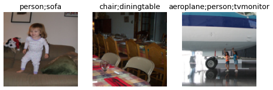
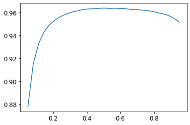
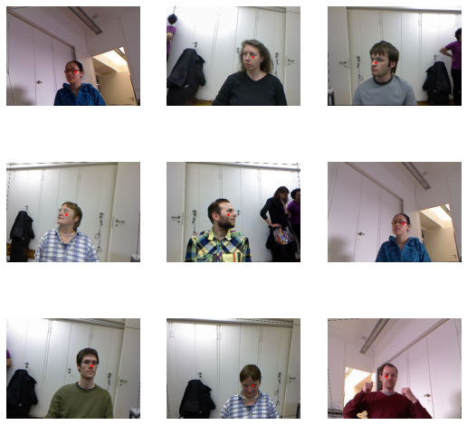
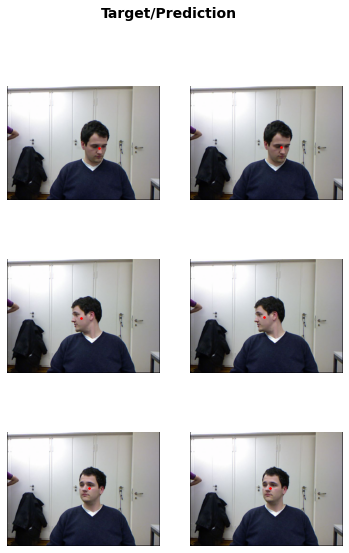

# <span style="color:#637ccf">Fastbook Notes - Chapter 6: Other Computer Vision Problems</span>


In this chapter, we are going to look at two other types of computer vision problems: multi-label classification and regression. 


**Regression** is when your labels are one or several numbers - a quantity instead of a category.

I will use Google Colab to run the code, as in [Chapter 5 notes](http://localhost:1313/today-i-learned-posts/fastbook-chapter5-image_classification/).

```python
!pip install -Uqq fastbook

     |████████████████████████████████| 727kB 29.0MB/s
     |████████████████████████████████| 1.2MB 45.6MB/s
     |████████████████████████████████| 194kB 47.3MB/s
     |████████████████████████████████| 51kB 7.9MB/s
     |████████████████████████████████| 61kB 9.2MB/s
     |████████████████████████████████| 61kB 9.0MB/s

```
```python
import fastbook
fastbook.setup_book()
from fastai.vision.all import *

    Mounted at /content/gdrive
```

# <span style="color:#FF9F1D">Multi-label classification</span>

**Multi-label classification** is when you want to predict more than one label per image (or sometimes none at all). In practice, it is probably more common to have some images with zero matches or more than one match, we should probably expect in practice that multi-label classifiers are more widely applicable than single-label classifiers.

##### PASCAL Visual Object Classes Challenge 2007 Dataset

```python
path = untar_data(URLs.PASCAL_2007)
```

```python
df = pd.read_csv(path/'train.csv')
df.head()
```

<table border="0" class="dataframe">
  <thead>
    <tr style="text-align: right;">
      <th></th>
      <th>fname</th>
      <th>labels</th>
      <th>is_valid</th>
    </tr>
  </thead>
  <tbody>
    <tr>
      <th>0</th>
      <td>000005.jpg</td>
      <td>chair</td>
      <td>True</td>
    </tr>
    <tr>
      <th>1</th>
      <td>000007.jpg</td>
      <td>car</td>
      <td>True</td>
    </tr>
    <tr>
      <th>2</th>
      <td>000009.jpg</td>
      <td>horse person</td>
      <td>True</td>
    </tr>
    <tr>
      <th>3</th>
      <td>000012.jpg</td>
      <td>car</td>
      <td>False</td>
    </tr>
    <tr>
      <th>4</th>
      <td>000016.jpg</td>
      <td>bicycle</td>
      <td>True</td>
    </tr>
  </tbody>
</table>


##### Building the DataBlock


The data is not preprocessed, so we will need to shape it correctly to use Fastai. 

:heavy_check_mark: **Step 1. Get the input path and the target variable**

The original dataset is a collection that returns a tuple of your independent and dependent variable for a single item. To use the `DataLoader` of Fastai we will need to format and preprocess the data. In a `DataLoader`, each mini-batch contains a batch of independent variables and a batch of dependent variables. 

We can see the current shape of the data by calling `DataBlock.datasets` to create a Datasets object from the source.

```python
dblock = DataBlock()
dsets = dblock.datasets(df)
```

```python
dsets.train[0]
```


    (fname       002815.jpg
     labels          person
     is_valid          True
     Name: 1414, dtype: object, 

     fname       002815.jpg
     labels          person
     is_valid          True
     Name: 1414, dtype: object)


```python
dsets.valid[1]
```
    (fname             000892.jpg
     labels      person motorbike
     is_valid               False
     Name: 443, dtype: object, 
     
     fname             000892.jpg
     labels      person motorbike
     is_valid               False
     Name: 443, dtype: object)


The data is in the wrong format. Instead of a path to the images and the corresponding label, it simply returns a row of the DataFrame, twice. This is because by default, the **`DataBlock` assumes we have two things: input and target**. Here we don't have a path or the target specified, so it returns the input twice. 

We are going to need to grab the appropriate fields from the DataFrame, which we can do by passing `get_x` and `get_y` functions.

- `get_x`: to create a function that points out the path of the files (in the *fname* column).

```python
def get_images_name(r): 
  return path/'train'/r['fname']
```

- `get_y`: to create a function that takes the targets from the labels column and splits on the space character as there are several labels.


```python
def get_target_name(r): 
  return r['labels'].split(' ')
```

We will try `DataBlock.datasets` again, now with the data formatted using the functions:

```python
# We add the data format to the DataBlock
dblock = DataBlock(get_x = get_images_name,
                   get_y = get_target_name)
# We update de dataset feeded to the DataBlock
dsets = dblock.datasets(df)
```


```python
dsets.train[34]

    (Path('/root/.fastai/data/pascal_2007/train/002359.jpg'), 
    ['dog'])
```


Now it returns correctly the datablock format: input (the *jpg*), and the target (the image label).

:heavy_check_mark: **Step 2. Transform the data into tensors**

We can use the parameter `ImageBlock` to transform these inputs and targets into tensors. It is a good practice to specify the `MultiCategoryBlock` method so fastai knows that is a multiclassification type of problem.

In any case, fastai would know that is this type of problem because of the multiple labeling.


```python
dblock = DataBlock(blocks =(ImageBlock, MultiCategoryBlock),
                   get_x = get_images_name,
                   get_y = get_target_name)

dsets = dblock.datasets(df)
```


```python
dsets.train[0]

    (PILImage mode=RGB size=500x336,
     TensorMultiCategory([0., 0., 0., 0., 0., 0., 1., 
                          0., 0., 0., 0., 0., 0., 1., 
                          1., 0., 0., 0., 0., 0.]))
```


By adding `ImageBlock`, each element is transformed into a tensor with a 1 representing the label of the image. The categories are **hot-encoded**. A vector of 0s and 1s in each location is represented in the data, to encode a list of integers. There are 20 categories, so the length of this list of 0s and 1 equals 20.

The reason we can't just use a list of category indices is that each list would be a different length. For example, an image with 2 labels would have 2 elements in a list and a length of 2. An image with 1 label would be a list of length 1. Pytorch/fastai require tensors where targets have to have the same length and that's why we use hot-encoding.


:heavy_check_mark: **Step 3. Create a training and validation data split**

For now, the dataset is not divided correctly into train and validation dataset. If we take a look at the dataset, it contains a column called `is_valid` that we have been ignoring. This column is a boolean that signals that the data belongs to the train set or the validation set. 


```python
df.head()
```
<table border="0" class="dataframe">
  <thead>
    <tr style="text-align: right;">
      <th></th>
      <th>fname</th>
      <th>labels</th>
      <th>is_valid</th>
    </tr>
  </thead>
  <tbody>
    <tr>
      <th>0</th>
      <td>000005.jpg</td>
      <td>chair</td>
      <td>True</td>
    </tr>
    <tr>
      <th>1</th>
      <td>000007.jpg</td>
      <td>car</td>
      <td>True</td>
    </tr>
    <tr>
      <th>2</th>
      <td>000009.jpg</td>
      <td>horse person</td>
      <td>True</td>
    </tr>
    <tr>
      <th>3</th>
      <td>000012.jpg</td>
      <td>car</td>
      <td>False</td>
    </tr>
    <tr>
      <th>4</th>
      <td>000016.jpg</td>
      <td>bicycle</td>
      <td>True</td>
    </tr>
  </tbody>
</table>


 `DataBlock` has been using a random split of the data by default. However, we can create a simple splitter function that takes the values in which `is_valid` is `False` and stored them in a variable called `train`, and if `True` stored them in a variable called `valid`. 


```python
def splitter(df):
  train = df.index[~df['is_valid']].tolist()
  valid = df.index[df['is_valid']].tolist()
  return train,valid
```

This function separates train and validation datasets to make the split. As long as it returns these 2 elements (train and validation), the `splitter` method of `DataBlock` can take it. 


```python
dblock = DataBlock(blocks=(ImageBlock, MultiCategoryBlock),
                   splitter = splitter,
                   get_x = get_images_name,
                   get_y = get_target_name)
dsets = dblock.datasets(df)
```


```python
dsets.train[0]

    (PILImage mode=RGB size=500x333,
     TensorMultiCategory([0., 0., 0., 0., 0., 0., 1., 
                          0., 0., 0., 0., 0., 0., 0., 
                          0., 0., 0., 0., 0., 0.]))
```

Now, the split of train and validation has the correct labeling.

:heavy_check_mark: **Step 4. Input resizing**

Lastly, for the `DataBlock` to be converted into a `DataLoader` it needs that every item is of the same size. To do this, we can use `RandomResizedCrop`.

To prove that, we can try the previous `DataBlock` without resizing:

```python
dls = dblock.dataloaders(df)
dls.show_batch(nrows=1, ncols=3)

    ---------------------------------------------------------------------------

    RuntimeError                              Traceback (most recent call last)

    <ipython-input-127-98aca4c77278> in <module>()
          1 dls = dblock.dataloaders(df)
    ----> 2 dls.show_batch(nrows=1, ncols=3)
    

    /.../core.py in show_batch(self, b, max_n, ctxs, show, unique, **kwargs)
         98             old_get_idxs = self.get_idxs
         99             self.get_idxs = lambda: Inf.zeros
    --> 100         if b is None: b = self.one_batch()
        101         if not show: return self._pre_show_batch(b, max_n=max_n)
        102         show_batch(*self._pre_show_batch(b, max_n=max_n), ctxs=ctxs, max_n=max_n, **kwargs)
    

[...]

    RuntimeError: stack expects each tensor to be equal size, 
    but got [3, 500, 441] at entry 0 and [3, 333, 500] at entry 1
```

By including resizing, the `DataBlock` is correctly loaded and transformed into a `DataLoader`:


```python
dblock = DataBlock(blocks=(ImageBlock, MultiCategoryBlock),
                   splitter = splitter,
                   get_x = get_images_name,
                   get_y = get_target_name,
                   item_tfms = RandomResizedCrop(128, min_scale=0.35))
dls = dblock.dataloaders(df)

dls.show_batch(nrows=1, ncols=3)
```


    

Fastai includes a method called `summary` to check if anything goes wrong when you create your dataset. Besides the previous printing of the batch, we can call it to see errors, if any.


```python
dblock.summary

    <bound method DataBlock.summary of 
    <fastai.data.block.DataBlock object at 0x7f01e42df2d0>>
```


###### Binary Cross Entropy and Categorical Cross Entropy


Now that we have our `DataLoaders` object we can move to define the loss function that we will use: ***Binary Cross Entropy*** (BCE). 

BCE is a kind of loss function for **multiple-labels** classification problem. It is slightly different from ***Categorical Cross Entropy***, the default loss function of **single-label** classification problem.

- In **Categorical Cross Entropy**, all the nodes of the final layer of the neural network go through a `softmax` transformation function that takes the most positive as the label predicted. The biggest positive value is transformed to 1 and the rest of the label values to 0.

- In **Binary Cross Entropy**, all the nodes of the final layer pass through a `sigmoid` function that transforms all the positive values above a threshold to 1, and the rest to 0. Several values can be above the threshold, as multiple labels could be present in the image. 

The *"Binary"* comes from having a prediction **for every category**. Every label is either 0 or 1, depending on if the label is present in the image.


:sparkles: *Why do we use sigmoid instead of softmax in multi-labeling?* 

Well, the image **in single-label classification cannot be 2 things at the same time**. An image is either labeled as "dog" or "cat", but cannot be both. Makes sense to use softmax and use the maximum value for the most probable predicted label - That would be a 1, and the rest 0s. 

The problem in multi-labeling is different. In **multicalss classification an image can contain several labels that are independent**. For example a dog, a cat, and a person in the same photo. Therefore, the probability of the label "dog" should not depend on the probability of the label "person". 

###### Sigmoid transformation in practice

To illustrate how sigmoid and the BCE loss function works we will build a simple model using the data that we formated before. 


We will use Restnet18 and pass a small batch to explore the outputs.

```python
# Model
learn = cnn_learner(dls, resnet18)

# Making sure that both the model and the data are processed in the GPU
learn.model = learn.model.cuda()
learn.dls.to('cuda')

# Passing one batch
X,y = dls.train.one_batch()

# Exploring the outputs of the last layer of the model
outputs = learn.model(X)
print(outputs.shape)
print(outputs[0])


    torch.Size([64, 20])
    tensor([ 0.0786,  0.6746, -1.7760,  2.8992,  0.9360, -0.1045, -2.5859,
            -0.3760, -0.6101, -0.6136,  3.0267, -0.5890, -0.2249, -0.5697, 
            -1.4767,  0.2276,  0.2324, -2.0516,  0.7298, -1.1993],
            device='cuda:0', grad_fn=<SelectBackward>)
``` 


:sparkles: *What are these `tensor` values?*

These are values corresponding to the nodes of the last layer. Note that these values haven't gone yet through the transformation function (sigmoid/softmax/others) that gets you the final label prediction. **After** the transformation function, these outputs will be either 0s (not that label) or 1s (label identified).

:sparkles: *What represents the "64" and "20" in `torch.Size([64, 20])`* ?

- 64 Refers to the number of images in the batch. 

Every batch is made of 64 images.  Trying to select the 65th image (`outputs[64]`) will show an out-of-range error because a batch contains only 64 images.


```python
outputs[64]


    ---------------------------------------------------------------------------

    IndexError                                Traceback (most recent call last)

    <ipython-input-134-2751f6a48786> in <module>()
    ----> 1 outputs[64]
    

    IndexError: index 64 is out of bounds for dimension 0 with size 64
```

- 20 are the number of categories or labels. 

It represents the last layer in the neural network. It has 20 nodes corresponding to the 20 different categories/labels. 


Now that we know the output of the model, we can apply to them a sigmoid transformation and the Binary Cross Entropy loss. We will take the first image of the batch `output[0]` and can call the `sigmoid()` method on it to see the difference in the results:


```python
print(outputs[0])

    tensor([ 0.0786,  0.6746, -1.7760,  2.8992,  0.9360,
            -0.1045, -2.5859, -0.3760, -0.6101, -0.6136,  
             3.0267, -0.5890, -0.2249, -0.5697, -1.4767,  
             0.2276,  0.2324, -2.0516,  0.7298, -1.1993],
           device='cuda:0', grad_fn=<SelectBackward>)

print(outputs.sigmoid()[0])

    tensor([0.5196, 0.6625, 0.1448, 0.9478, 0.7183, 
            0.4739, 0.0700, 0.4071, 0.3520, 0.3512, 
            0.9538, 0.3569, 0.4440, 0.3613, 0.1859, 
            0.5566, 0.5578, 0.1139, 0.6748, 0.2316], 
           device='cuda:0', grad_fn=<SelectBackward>)
```   

Notice that the sigmoid function transforms all the predictions of the model (outputs) into a **range 0 to 1**. This is very useful for Binary Cross Entropy loss as it requires every label to be either a 1 or a 0. 

Remember that each of the 20 values of the `tensor` represents a label, and the number resulting from this transformation represents the probability of this label. 

:sparkles: How do we select which predictions are 1s and which ones 0s?

The easiest solution is **setting a threshold**, a value, positive enough that we consider that the label is predicted. All the values more than this threshold are transformed to 1, or labels predicted. 

For example, let's take the last outputs in `outputs.sigmoid()[0]` above and set a threshold of 0.7. The label associated with the node with the value `0.9478` and `0.7183` are the predicted labels, for the 18 other labels are not activated as they are below the threshold.

Here we have shown the transformation for the first image - index 0 (`[0]`). In practice, we apply sigmoid for every batch of the model and select the values for Binary Cross Entropy into the same step as we see next.

##### Sigmoid Threshold Optimiazion

The default threshold used for the Sigmoid transformation is 0.5. However, it can be other values as we saw in the last section setting 0.7. There is **no way to see if the default value is a good threshold before you try with several** thresholds. 

To test this, we will build the model with different thresholds and give them some epochs to see if the accuracy changes.


```python
# Deeper Model with more batches
learn = cnn_learner(dls, resnet50, 
                    metrics = partial(accuracy_multi, thresh = 0.2))

# Optimize the learning rate
lr_suggested = learn.lr_find()[0]

# Freeze the first 5 epochs and run 5 epochs
learn.fine_tune(5, base_lr = lr_suggested, freeze_epochs= 5)
```

<table border="0" class="dataframe">
  <thead>
    <tr style="text-align: left;">
      <th>epoch</th>
      <th>train_loss</th>
      <th>valid_loss</th>
      <th>accuracy_multi</th>
      <th>time</th>
    </tr>
  </thead>
  <tbody>
    <tr>
      <td>0</td>
      <td>0.988882</td>
      <td>0.733648</td>
      <td>0.200498</td>
      <td>00:40</td>
    </tr>
    <tr>
      <td>1</td>
      <td>0.897558</td>
      <td>0.651835</td>
      <td>0.226036</td>
      <td>00:40</td>
    </tr>
    <tr>
      <td>2</td>
      <td>0.797924</td>
      <td>0.555892</td>
      <td>0.264064</td>
      <td>00:40</td>
    </tr>
    <tr>
      <td>3</td>
      <td>0.654679</td>
      <td>0.331369</td>
      <td>0.504701</td>
      <td>00:40</td>
    </tr>
    <tr>
      <td>4</td>
      <td>0.454360</td>
      <td>0.168649</td>
      <td>0.888008</td>
      <td>00:41</td>
    </tr>
  </tbody>
</table>

<table border="0" class="dataframe">
  <thead>
    <tr style="text-align: left;">
      <th>epoch</th>
      <th>train_loss</th>
      <th>valid_loss</th>
      <th>accuracy_multi</th>
      <th>time</th>
    </tr>
  </thead>
  <tbody>
    <tr>
      <td>0</td>
      <td>0.192024</td>
      <td>0.137152</td>
      <td>0.931693</td>
      <td>00:45</td>
    </tr>
    <tr>
      <td>1</td>
      <td>0.164923</td>
      <td>0.118155</td>
      <td>0.942410</td>
      <td>00:46</td>
    </tr>
    <tr>
      <td>2</td>
      <td>0.139310</td>
      <td>0.108408</td>
      <td>0.952570</td>
      <td>00:46</td>
    </tr>
    <tr>
      <td>3</td>
      <td>0.118630</td>
      <td>0.106424</td>
      <td>0.950259</td>
      <td>00:45</td>
    </tr>
    <tr>
      <td>4</td>
      <td>0.104928</td>
      <td>0.105443</td>
      <td>0.952151</td>
      <td>00:46</td>
    </tr>
  </tbody>
</table>

{}
Please note that instead of changing the entire model you can use `metrics` and `partial`. The sigmoid threshold only applies to the last layer of the neural network.
{}


```python
learn.metrics = partial(accuracy_multi, thresh = 0.5)
learn.validate()

    (#2) [0.10544303804636002,0.9638046622276306]
```

Using `validate()` returns the validation loss (`valid_loss`) and the metrics loss (`accuracy_multi` in this case). A threshold of 0.5 produces a slightly better accuracy loss (0.964 vs previous 0.952)

As you can imagine, there must be a way to loop over several thresholds instead of trying all possible thresholds by hand. 

To loop over different values we can make a batch of predictions using `get_preds` and use this batch of predictions to loop a range of possible thresholds and compare accuracy.


```python
# Batch of predictions
train, targs = learn.get_preds()

# Possible sigmoid thresholds, from 0.05 to 0.95
thr = torch.linspace(0.05,0.95,29)

# Accuracy loop
accs = [accuracy_multi(train, targs, thresh=i, sigmoid=False) for i in thr]

# plot them
plt.plot(xs,accs)
```


    
The x-axis denotes the threshold values, and the y-axis the accuracy values. We can see that a sigmoid threshold between 0.45 and 0.7 gives us around 0.96 accuracies in the validation set. 

{}
`get_preds()` apply by default sigmoid, so you will have to set `accuracy_multi(sigmoid=False)` in the model to not pass the transformation twice. 
{}


## <span style="color:#FF9F1D">Regression</span>


Image regression refers to learning from a dataset in which the independent variable is an image or element, and **the dependent variable is one or more floats**.

Perhaps we have an independent variable that’s an image, and a dependent that’s text (e.g. generating a caption from an image); or perhaps we have an independent variable
that’s text and a dependent that’s an image (e.g. generating an image from a caption).

To illustrate this kind of model we’re going to do a **key point model**. A key point refers to a specific location represented in an image. So the input is face images, and the output should be a float with the coordinates of the center of the face.

##### Head Pose Dataset

The data needs a little preprocessing and formating. The idea is the same as before, creating a function that points to the path of the data and create targets.

The path of the images is inside objects formatted as `obj`. The targets will be created with a function that calculates the center of the image. The model will try to predict the coordinates of the center of the image. 


```python
# Load data
path = untar_data(URLs.BIWI_HEAD_POSE)
```

<div>
    <style>
        /* Turns off some styling */
        progress {
            /* gets rid of default border in Firefox and Opera. */
            border: none;
            /* Needs to be in here for Safari polyfill so background images work as expected. */
            background-size: auto;
        }
        .progress-bar-interrupted, .progress-bar-interrupted::-webkit-progress-bar {
            background: #F44336;
        }
    </style>
  <progress value='452321280' class='' max='452316199' style='width:300px; height:20px; vertical-align: middle;'></progress>
  100.00% [452321280/452316199 00:09<00:00]
</div>

$$
$$

The data is inside this objects `obj` and there are 24 objects.

```
path.ls()

    (#50) [Path('/root/.fastai/data/biwi_head_pose/14.obj'),
           Path('/root/.fastai/data/biwi_head_pose/18'),
           Path('/root/.fastai/data/biwi_head_pose/06.obj'),
           Path('/root/.fastai/data/biwi_head_pose/io_sample.cpp'),
           ...]
```
Every object has 1000 images and labeled poses.

```
(path/'01').ls()

    (#1000) [Path('/root/.fastai/data/biwi_head_pose/01/frame_00307_pose.txt'),
             Path('/root/.fastai/data/biwi_head_pose/01/frame_00159_pose.txt'),
             Path('/root/.fastai/data/biwi_head_pose/01/frame_00363_pose.txt'),
             Path('/root/.fastai/data/biwi_head_pose/01/frame_00434_pose.txt'),
             ...]
```

We will create the function `img2pose` to extract the pose path.

```python
img_files = get_image_files(path)
# write a function that converts an image filename
def img2pose(x): return Path(f'{str(x)[:-7]}pose.txt')
```

Now that we have the pose and the image path, we should have the images in *jpg* and the labels in *txt* format under the same identifier.

```python
print(img_files[0])
print(img2pose(img_files[0]))

    /root/.fastai/data/biwi_head_pose/18/frame_00518_rgb.jpg
    /root/.fastai/data/biwi_head_pose/18/frame_00518_pose.txt
```    

Let's take a look at an image.


```python
im = PILImage.create(img_files[0])
im.to_thumb(224)
```
    

    
We extract the center of the image creating a function that returns the coordinates as a tensor of two items. However, the details of the function are not important. Every dataset will require a different cleaning a formatting process.

```python
cal = np.genfromtxt(path/'01'/'rgb.cal', skip_footer=6)
```

```python
def get_ctr(f):
  ctr = np.genfromtxt(img2pose(f), skip_header=3)
  c1 = ctr[0] * cal[0][0]/ctr[2] + cal[0][2]
  c2 = ctr[1] * cal[1][1]/ctr[2] + cal[1][2]
  return tensor([c1,c2])
```


```python
# The center of the image is the label that we are trying to predict
get_ctr(img_files[0])

    tensor([344.3451, 330.0573])
```

##### Building the DataBlock


```python
biwi_data = DataBlock(
    blocks=(ImageBlock, PointBlock),
    get_items=get_image_files,
    get_y=get_ctr,
    # Splitter function that returns True for just one person, 
    # as we dont want to train with the same person all over and over.
    splitter=FuncSplitter(lambda o: o.parent.name=='13'),
    # Data augmentation and normalization
    batch_tfms=[*aug_transforms(size=(240,320)),
                Normalize.from_stats(*imagenet_stats)]
)
```

```python
dls = biwi_data.dataloaders(path)
dls.show_batch()
```
    

    


The input is the image, and the target is the red dots. The batch of data looks correct. 

##### Modeling

```python
learn = cnn_learner(dls, resnet18, y_range=(-1,1))
```

When coordinates are used as the dependent variable, most of the time we’re likely to be trying to predict something as close as possible, so we would like to use the MSE loss function. We can check the default loss function using `loss_func`:


```python
learn.loss_func

    FlattenedLoss of MSELoss()
```


Fastai applied the loss function correctly. Let's find a good learning rate and fit the model. You can use `one_cyle_fit` instead of `fine_tune` to save time using large learning rates (more [here](https://fastai1.fast.ai/callbacks.one_cycle.html) and [here](https://arxiv.org/abs/1708.07120)).

```python
lr_finder = learn.lr_find()
learn.fine_tune(7, lr_finder[0])
```


<table border="0" class="dataframe">
  <thead>
    <tr style="text-align: left;">
      <th>epoch</th>
      <th>train_loss</th>
      <th>valid_loss</th>
      <th>time</th>
    </tr>
  </thead>
  <tbody>
    <tr>
      <td>0</td>
      <td>0.111715</td>
      <td>0.004949</td>
      <td>03:32</td>
    </tr>
  </tbody>
</table>


<table border="0" class="dataframe">
  <thead>
    <tr style="text-align: left;">
      <th>epoch</th>
      <th>train_loss</th>
      <th>valid_loss</th>
      <th>time</th>
    </tr>
  </thead>
  <tbody>
    <tr>
      <td>0</td>
      <td>0.009237</td>
      <td>0.001873</td>
      <td>04:41</td>
    </tr>
    <tr>
      <td>1</td>
      <td>0.003953</td>
      <td>0.000574</td>
      <td>04:41</td>
    </tr>
    <tr>
      <td>2</td>
      <td>0.002914</td>
      <td>0.000619</td>
      <td>04:41</td>
    </tr>
    <tr>
      <td>3</td>
      <td>0.002445</td>
      <td>0.000372</td>
      <td>04:41</td>
    </tr>
    <tr>
      <td>4</td>
      <td>0.001847</td>
      <td>0.000476</td>
      <td>04:41</td>
    </tr>
    <tr>
      <td>5</td>
      <td>0.001449</td>
      <td>0.000187</td>
      <td>04:41</td>
    </tr>
    <tr>
      <td>6</td>
      <td>0.001440</td>
      <td>0.000143</td>
      <td>04:41</td>
    </tr>
  </tbody>
</table>

The predicted center points are quite close to the real center of the faces!

```python
learn.show_results(ds_idx=1, max_n = 3)
```

    

    
In problems that are at first glance completely different (single-label classification,
multi-label classification, and regression), we end up using the same model with just
different numbers of outputs. The loss function is the one thing that changes, which
is why it’s important to double-check that you are using the right loss function for
your problem using `loss_func`.
