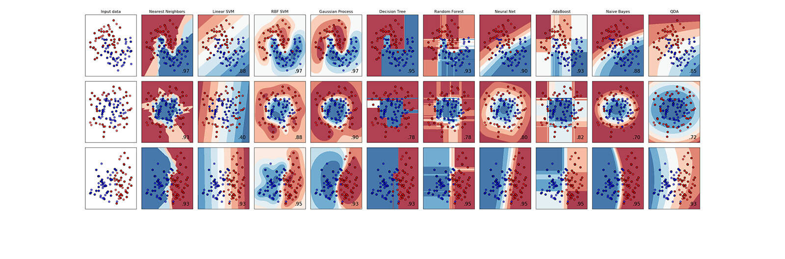
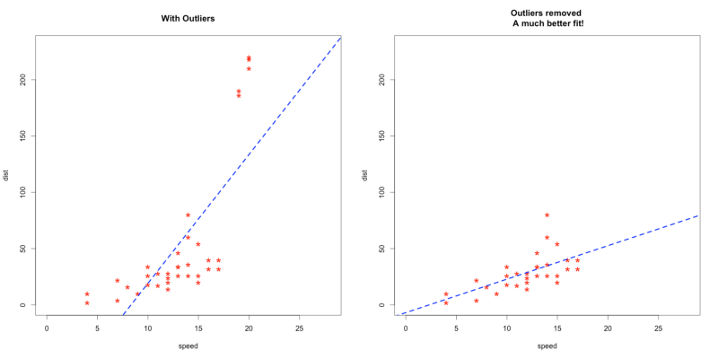
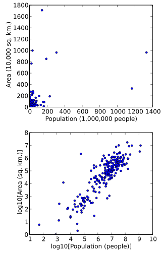
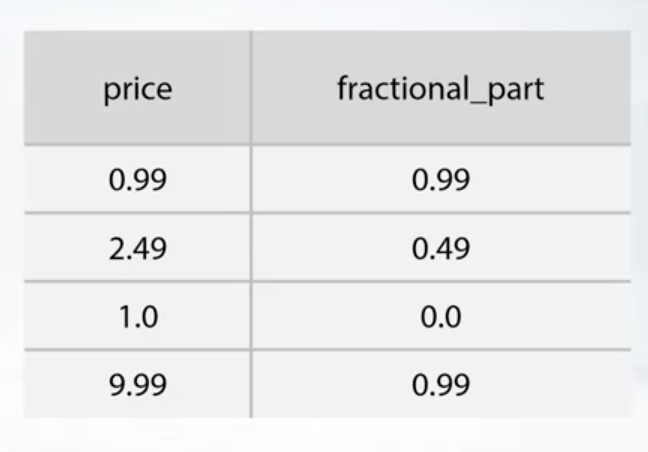
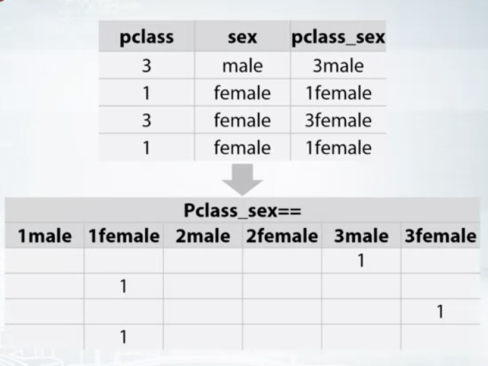
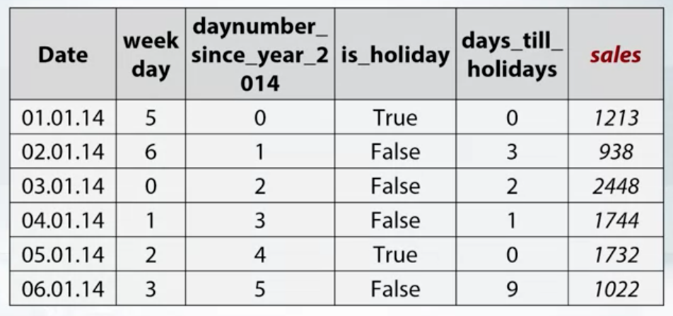
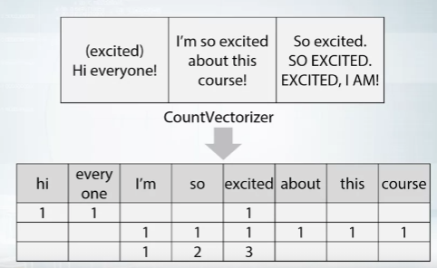

# <span style="color:#FF9F1D"> Competition mechanics </span>

### Places To compete:

- [Kaggle](https://www.kaggle.com/competitions)

- [DataDriven](https://www.drivendata.org/competitions/)

- [Crowdanalytix](https://www.crowdanalytix.com/community)

- [CodaLab](https://competitions.codalab.org/)

- [Brigit](https://bitgrit.net/competition/)


### Why participate:

- Network.
- Way to try state of the art approaches.
- Get notoriety in Data Science field.

### Real World Application vs Competitions

**Real-world ML Pipeline**:

- Understanding business problems (Big picture).
- Problem formalization. What is the target metric? How to measure the accuracy?
- Data collecting.
- Data preprocessing.
- Modelling.
- Evaluate the model using updated data.
- Deploy the model.

**Competition Pipeline**:

1. Data Preprocessing.
2. Modelling.

# <span style="color:#FF9F1D"> Recap of main ML algorithms </span>

Families of ML algorithms:

- Linear (Logistical regression or SVM)
- Tree-based (Decision Trees, Random Forest, XGB)
- k-Nearest Neighbors
- Neural Networks



For a rule of thumb, follow sklearn route-map:


# <span style="color:#FF9F1D"> Feature preprocessing: Scaling Numeric features </span>

Feature preprocessing and **feature generation is necessary to win competitions**.

Scaling is another hyperparameter to optimize, different scaling techniques result in different model predictions. **Tree-based models do not depend on scaling**.

Linear and neural networks require scaling preprocessing to perform well. Linear models experience difficulties with differently scaled features, and gradient descent methods do not converge easily without scaling.

**1. MinMaxScaler**

It scales every feature from 1 (the maximum feature number) to 0 (the minimum).

$$
X = \frac{(X - min())}{X.max()- X.min()}
$$

```python
sklearn.preprocessing.MinMaxScaler

sc = MinMaxScaler()
data_scaled = sc.fit_transform(data))
```

**2. StandardScaler**

It normalizes every feature to have a mean 0 and a standard deviation of 1.

$$
X = \frac{(X - mean())}{X.std()}
$$

```python
sklearn.preprocessing.StandardScaler

sc = StandardScaler()
data_scaled = sc.fit_transform(data))
```

In non-tree models, the type of feature scaler leads to similar results. In K-NN however, it is important.

**3. Winsorization**

The pattern of linear models can be affected by the weight of outliers:



To "protect" the trend from the effect of outliers, we can clip the data among a certain threshold. For example, keep only the 1st percentile as the lower bound and the 99th percentile as the upper bound, and getting rid of all the other observations (winsorization).

```python
# Set the thresholds
Upperbound, Lowerbound = np.percentile(data, [1,99])
# Clip the data
data_clipped = np.clip(data, Upperbound, Lowerbound)
```

Other option:

```python
from scipy.stats.mstats import winsorize

data_clipped = winsorize(data, limits = 0.01)
```

**4. Rank Transformation**

Rank transform removes the relative distance between feature values and replaces them with a consistent interval representing feature value ranking. It "moves" the outliers closer to other feature values.

It is an easy way to dealing with outliers when the dataset is too large to handle outliers manually.

```python
from scipy.stats import rankdata

data_array = [0, 2, 3, 2]
data_array_ranked = rankdata(data_array)

# Output of print(data_array_ranked)
array([ 1. ,  2.5,  4. ,  2.5])
```

**5. Logistical Transformation and Raising to the power of <1**

Help especially in Neural Networks.

Visually:




```python
# Log transformation of a column feature
data['feature_log_transformed'] = np.log(data['feature'])

# Raising a column feature to the power of 2/3
data['feature_raised'] = np.power(data['feature'], (2/3))
```

# <span style="color:#FF9F1D"> Feature preprocessing: Encoding Categorical features </span>

Categorical and numerical features can be both numbers. For example, the rank in the last *Football UEFA Championship* (categorical: 1st,2nd,3rd or 4th) and the number of goals (numerical: 12,9, or 5) of a given team.

**Why convert categorical a column to a numerical one, if already is a number?**

Because of the distance between the numerical numbers. The difference between 1 and 2 is always 1, but what's the difference between the first and the second? The second is twice, three times worse than the 1st? Not even a 20% worse?

Categories are different features of the data, even if they are also numbers.

### Label encoders

We need to convert categorical values into categories on its own. Most models cannot handle text or categories without being encoded in numerical values.

**1. Label Encoding for linear models, k-NN, and Neural Networks**

The most usual way:

```python
from sklearn.preprocessing import LabelEncoder, OneHotEncoder
```

For the hot encoder, we have to take care that the categories don't have too many unique values, as it will create a new feature for every unique value. It can lead to worse performance in tree models.

**2. Label Encoding for Tree-based models**

Apart from the usual label encoders, we can create an encoding that preserves the distribution of the categories, instead of using integers:

```python
dist_encoder = data.groupby('categoty').size()
dist_encoder = dist_encoder / len(data)
data['new_category'] = data['category'].map(dist_encoder)
```

For example, let's imagine a category representing education: Elementary, High School, University. 30% of the people only have elementary school achieved, 45% High school and 25% University. Then:

The Elementary category is replaced by 0.3, High School by 0.45, and University by 0.25.

**If the value frequency is correlated with the target value, this new category would help both linear and tree-based models**

What if the within the categories, 2 have the same distribution?

We can use scipy.stats.rankdata. More information [here](https://docs.scipy.org/doc/scipy/reference/generated/scipy.stats.rankdata.html)


# <span style="color:#FF9F1D"> Feature generation </span>

Feature generation relies hugely on the **understanding of the data**. This is especially what differentiates a great competitor from a good one. Based on exploratory data analysis and prior knowledge of the problem, new features can be created.

For example, let's say that the objective is predicting if a house will be sold within a month.  We have the features: *Squared area*, and *price* of several houses. A new feature can be created: *price per squared meter*.

Another example, predicting the amount of sold items among different grocery items. If we have the price, we can create a feature "fractional_part" that captures the psychological effect of reducing the lef digits by 1 unit:



Any logical relationship between the variables can help the algorithm (even tree models) to converge more easily.

### Creating an interaction between several categorical features

The algorithm can adjust for the combination of features to get better results. For example, it might be the case that for the survival in the Titanic disaster it mattered to be women as they go into the rescue boats first. But, if they are in the lowest class, it doesn't matter (*pclass* = 3).

Hot encoding a combination of features can adjust the probability of survival better.




One of the most useful feature creation in non-tree-based models (linear, k-NN, NNs).

# <span style="color:#FF9F1D"> Datetime </span>

We can use dates to generate features. The more features will be related to:

**1. Periodicity**
**2. Time since a particular event**
**3. Difference between dates**

For example, with sales prediction over a period of time, we can add a column with the days since a certain campaign, if the day was a holiday, or the days until the holiday comes:



Using the difference between the last purchase and the last call to the customer service, as a new feature (difference between dates).

# <span style="color:#FF9F1D"> Coordinates </span>

It is useful to use the map coordinates to generate new features for tasks where the objective involves coordinates. For example, to predict housing prices it is useful to generate new features such as:

- The distance to the closest hospital, school, monument, park...
- The distance to the highest-priced house in the neighborhood.
- The cluster price of the nearest 10 houses.

# <span style="color:#FF9F1D"> Handling missing values </span>

{}
Tip!: Avoid filling NaN before feature generation.
{}

**Locating missing values**: plot the distribution of the columns and see the values way outside of the tails.

The choice of method to fill NaN depends on the situation. Filling missing values **strategies**:

**1. Tree models**: Filling with a constant value like -999  would take the missing value into a separate category. When you calculate the means of the feature, take into account that you have done this filling method.

**2. Linear models and Neural Network**s: fill with the mean or median. This has to be taken carefully. If the function that we try to approximate is not linear, it will fill the missing values with no better than random numbers.

**3. Create an "Isnull" feature**: keep the missing values, and create a boolean column called "isnull".

**4. Low-hanging fruit reconstructions**: if possible, you can interpolate the value using the close-by data points.

**5. Model reconstruction**: train a model to predict missing values.

# <span style="color:#FF9F1D"> Bag of words </span>



Transforming sentences into an array of values:

```python
from sklearn.feature_extraction.text import TfidfTransformer, TfidfVectorizer
from sklearn.feature_extraction.text import CountVectorizer
import pandas as pd

text_example = ["(excited) Hi everyone!",
                "I'm so excited about this course",
                "So excited. SO EXCITED. EXCITED, I AM!"]

# CountVectorizer instance
count_vect = CountVectorizer()

# Fit the data
text_vector = count_vect.fit_transform(text_example)

# Create dataframe
df = pd.DataFrame(text_vector.toarray(),
                  columns = count_vect.get_feature_names())
```

# <span style="color:#FF9F1D"> TfidfTransformer </span>

**TF** means term-frequency while **TF-IDF** means term-frequency times inverse document-frequency.

**TF normalizes the sum of the row values to 1, while IDF scales features inversely proportionally to the number of word occurrences over documents.**

This is a common term weighting scheme in information retrieval, that has also found good use in document classification.

Example:

```python
# TfidfVectorizer instance
tfidf_vect = TfidfVectorizer()

text_vector_tfidf = tfidf_vect.fit_transform(text_example)

df_2 = pd.DataFrame(text_vector_tfidf.toarray(),
                  columns = tfidf_vect.get_feature_names())
```

# <span style="color:#FF9F1D"> Word processing and text normalization </span>

The argument **ngram_range** allows to create more columns for word combination. For example, seting *count_vect = CountVectorizer(ngram_range= [1,3])* creates the column *about* (unigram) but also *about this* (bigram) and *about this course* (trigram).

Is also important the argument **stop_words**, that would remove the words in the vocabulary that do not add important information or meaning to the sentence such as *I, am, you, the...*

**Stemming** can be used to group the same stem words into the same column. Stemming is the process of reducing inflection in words to their root forms such as **mapping a group of words to the same stem**. It can analyze invented words, slang, or words without a morphological root, but also chops short words to meaningless stems (*saw** and *see** reduced to *s*)

**Lemmatization** is used for the same, and it is almost the same in practical terms. In Lemmatization root word is called Lemma. With lemmatization **each column returns an actual word of the language**, it is used where it is necessary to get valid word. (*saw* and *see* reduced to *see*, *BRRRRR* reduced to no column as it doesn't have a grammatical root.)

# <span style="color:#FF9F1D"> Word2Vec </span>

The word2vec **algorithm uses a two-layer neural network model to learn word associations from a large corpus of text.**

Word2vec takes as its input a large corpus of text and produces a vector space, typically of several hundred dimensions, with each unique word in the corpus being assigned a corresponding vector in the space.


Example in python:

```python
w2v_model = Word2Vec(min_count=20,
                     window=2,
                     size=300,
                     sample=6e-5,
                     alpha=0.03,
                     min_alpha=0.0007,
                     negative=20,
                     workers=cores-1)

w2v_model.build_vocab(sentences, progress_per=10000)
# 'sentences' variable is a vector of words
w2v_model.train(sentences,
                total_examples=w2v_model.corpus_count,
                epochs=30,
                report_delay=1)

w2v_model.wv.most_similar(positive=["Random_Word_from_Sentences"])
```

# <span style="color:#FF9F1D"> Pre-trained Neural Networks (CNN) </span>

Neural networks are initialized with random weights (usually) that after a series of epochs reach some values that allow us to properly classify our input images.

What would happen if we could initialize those **weights to certain values that we know beforehand that are already good to classify** a certain dataset?

Using a pre-trained model we can take advantage of the *better than random* weighting of the model in other datasets (transfer learning).

With fine-tuning, it is not necessary to go through the trial and error of how many layers to use, how many neurons in each layer, which regularization or learning rate to use...you **take a Neural Network architecture already defined in another task for the new task.**

Giving that the task is different (instead of classifying let's say cars, it classifies trucks), the last layer of the pre-trained model is replaced by a new one designed for the new task. Only the weights of the new layers are updated.

Pre-trained models can be found on keas website: https://keras.io/api/applications/

For example:

```python
tf.keras.applications.DenseNet121(
    include_top=True,
    weights="imagenet",
    input_tensor=None,
    input_shape=None,
    pooling=None,
    classes=1000,
)
```
