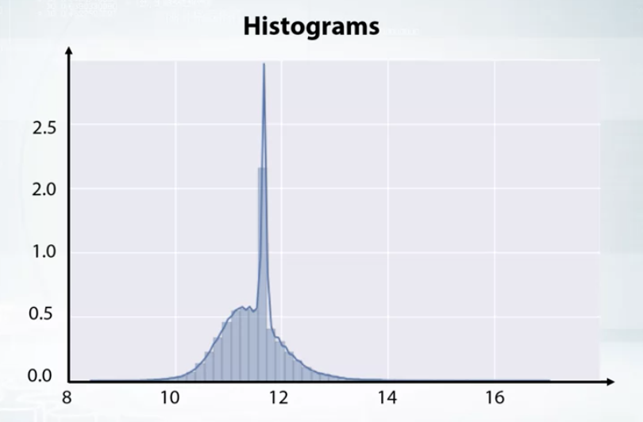
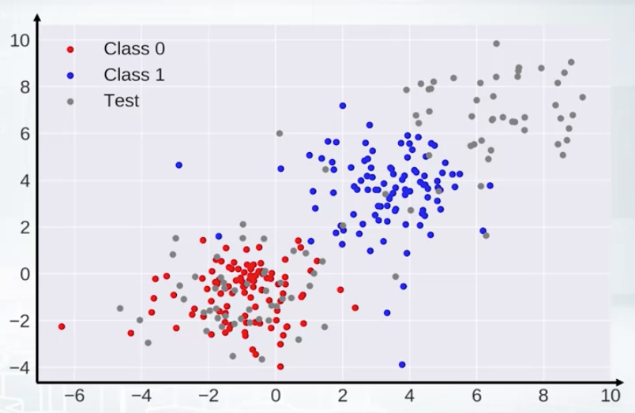
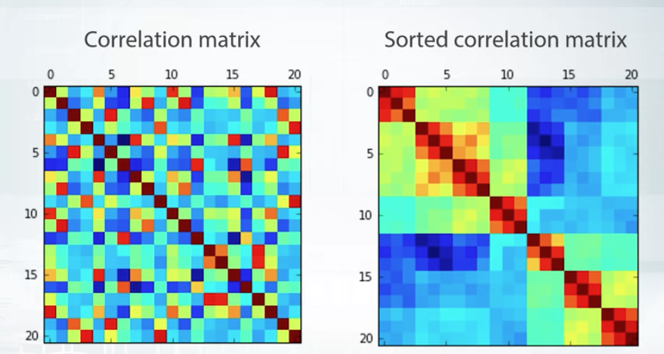
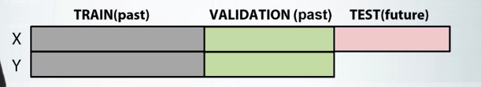
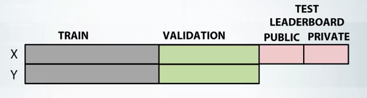
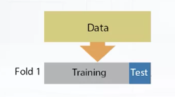
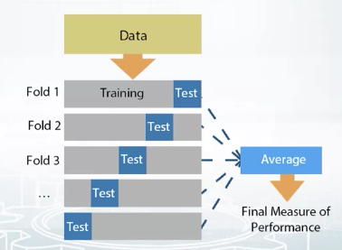
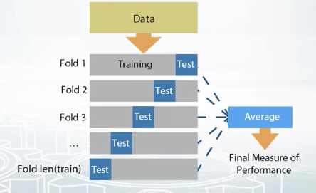
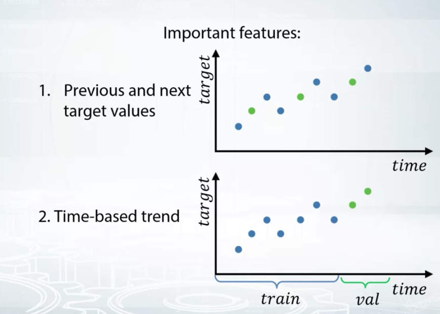

#  Approaching a competition

First steps in a competition:

- **Understand the task and the data**, build an intuition about the columns, what kind of features are important, and so forth.

- **Visualize patterns in the data**. Ask yourself why is the data is constructed the way it is and try to build an initial hypothesis to check.

What **not** to do:

- **Start modeling**. Use descriptive visualization to understand better the features.

#  Building intuition about the data 

Steps to build a sense of the dataset:

### 1. Get domain knowledge

Most of the time you start a competition without knowing anything about the topic. It's normal to use **Google and Wikipedia**. Read several **articles** about the topic to understand the description of the columns, and make sense of the data.

### 2. Check if the data correspond to the domain knowledge

**Check the values in the columns**. Do they make sense according to the data description, or your knowledge of the topic?

Mistakes can create advantages in competitions. Create a new feature (<code>column "is_correct"</code>) simply with a boolean indicating if the row makes sense (<code>True</code>) or not (<code>False</code>)

### 3. Understand how the data was generated

**Do the train set and validation set to come from the same distribution?**.

 The organizers of the competition can use different data generation processes for the data sets. A **symptom of different data generation processes** is improving the model prediction in the validation set but not in the leaderboard public score. Since the leaderboard is tested with the organizer's non-seen data, a gap between the two can be a sign that the data is different.

 Modeling on the training set will never approximate the global minimum if the validation and train set comes from different distributions.

#  Exploring anonymized data 

Sometimes the organizers *hash* (means normalize or code) some sensible data but leak some hint about the data that helps encode the data. Decoding or guessing the hash values is **important for choosing the right model** and improving model performance.

Try:

- Print the **unique values**: <code>unique()</code>
- **Check the mean and standard deviation**. If it's close to 0 and 1, the data was normalized by the organizers.
- **If normalized, sort the unique values of the column ( <code>np.sort(X_train.column_1.unique()</code>) and divide the column by the constant difference that you observe** to uncode it.

If you cannot investigate the exact numbers behind the hash, **at least guess the data type** (numerical, categorical, ordinal...) to process the columns accordingly to the type.

#  Visualizations 

### 1. Exploration of individual features

Histograms (<code>plt.hist(x)</code>): Check the number of bins and scale to get the distribution picture are right. An **abnormal peak in the distribution could signal that the missing values were labeled as that number by organizers.** For example:

The value can be replaced for NaN, by -999, or simply including a boolean column indicating that in that row it was this abnormal value.

**General statistics** (<code>df.describe()</code>) can also signal not normally distributed values.

### 2. Exploration of feature relations.

**Scatterplots** (<code>plt.scatter(x1, x2)</code> and <code>pd.scatter_matrix(df)</code>). We can use scatterplots to check if the data distribution of the train and test data are the same:

**Correlation matrix** (<code>df.corr()</code>) and **clustering plots** (<code>df.mean().sort_values().plot(style = ".")</code>) can also help to detect relationship between the variables.

#  Dataset cleaning and other things to check 

### Check if a feature is constant in the train set but not in the test set or vice versa.

The general advise is that it is better to remove constant features. In general, constants does not help as in doesn't signal any difference in the characteristics between labels. In pandas you can find constants by:

<code>df.nunique(drop = True).sort_values().head()</code>

If the feature has 1 unique value, is a constant.

To drop them, first store the possible constants (<code>constants = df.nunique(drop = True)</code>), list the observations that has only 1 unique value as they are constants  (<code>constant_columns = constants.loc[constants == 1].index.tolist()</code>), finally drop this columns from the dataset (<code>df.drop(columns = constant_columns, inplace = True)</code>)

### Check if two columns are duplicated (or scaled)

The first step is trying to understand why they are duplicated. It is a mistake by the organizers? Can we get an intuition behind why they are duplicated?

If you cannot extract any useful information from them you can remove them ( <code>df.T.drop_duplicates()</code>).

### Explore the name of the columns.

If the name is something like <code>RP_17, RP18, RP_19, VAR_89, VAR_90</code>, it could indicate a sequence or a time series.

### Check if the data was shuffled.

The index may indicate that the train and test data are indeed from the same dataset: a clear example could be that the indexes in the train data are labeled as 1,3,5,7 and in the test data 2,4,6,8.

#  Validation strategies 

In a usual fashion, data can be split into train, test, and validation chunks:

**In competitions, the test data is divided into public and private**. Public split is used to calculate your score into the public leaderboard and as a measure of how your model performs. However, the final score is determined by how the model performs in the unseen private split that only the organizers have access to:

**Avoid overfitting the public split**. A high public leaderboard can be improved just by uploading the same model with different seed thousands of times. If the model overfits the public test split, is more likely that performs poorly on the private split.

### Holdout split

<code>sklearn.model_selection.ShuffleSplit</code>

The simplest split. It splits the data into train data and validation data, without overlapping.

Train and validation observations cannot overlap because otherwise the model would be overfitted. It would learn the specific parameters that it has seen for the observation in the training set that fits perfectly the validation set, not because there are optimal but because is the same observation.

### K-fold Cross-Validation

<code>sklearn.model_selection.KFold</code>

**K-fold is holdout done multiple times**. It splits the data into different parts and iterates through them, using every part as a validation set only once.

It is recommended for large enough data.

### Leave-One-out Cross-Validation or Jackknife

<code>sklearn.model_selection.LeaveOneOut</code>

All *n* data points are repeatedly split into a training set containing **all but one observation**, and the validation set contains only that observation.

In the first split, the split leaves out observation number 1.  In the second split, it leaves out observation number 2. At the end of the loop, you would have *n+1* splits, one for any *n* observation plus an entire split with the collected observation that they are being excluded previously.

All the validation strategies split the dataset into chunks. The main difference is how large are these chunks.

- Only one iteration and one chunk: Holdout.
- K iteration and chunks: K-fold CV.
- All the iterations and chunks possible without repetition: Jackknife.

# Stratification

**In small samples, the distribution of the different classes or labels** is an important aspect to take into account. Setting a stratify parameter will preserve the proportion of target as in the original dataset, in the train and test datasets as well. In other words, make sure that the distribution of classes is the same in the train set and the validation set

For example, if the original dataset df has target/label as [0,1,2] in the ratio say, 40:30:30. By stratification, in every split made there will be 40, 30, and 30 observations of target 0,1 and 2 respectively.

It makes sense to stratify because **if there are not enough observations between classes in the training splits, the model cannot learn to differentiate the target**.

**Stratification is necessary for**:

- Small datasets.
- Unbalanced datasets (over-represented label).
- Multiclass classification.

**It never hurts to stratify**. In large datasets, the sample target distribution will be the same as the population target distribution because of the law of the large numbers. The bigger the sample, the more similar is to the total population.

It can be applied in sklearn: <code>train_test_split(x,y,test_size=0.1,stratify=y)</code>

#  Time series splitting strategies 

The way the split is made can change the performance of the model significantly. In time series, the train-validation split can be made in 2 ways:

1. **Using previous observations as train data** and present observations as validation.
2. **Using both past and present observations to train** the model, and using observations in between as validation data.

### When it makes sense to use sequential/timewise split?

When choosing between a random or a sequential split, it must be taken into account the structure of the data itself and the covariates that can be created. **If the test data is in the future time, it makes more sense to split in a sequential way**.

The creation of features depends on the train-test data splitting method. To generate features that describe time-based patterns it is necessary a timewise split (sequential. A random-based split would wipe out the correlation between the closest observations and it would destroy time patterns.

### When it makes sense to use random split?

When the observations are independent is advised to use a random split.

**The general rule of thumb is to set up the validation split to mimic the test split of the competition**. So if the private data (the data that the model will be tested by the organizers) is a random sample of the dataset, split your training/test data in random splits. However, if the private data is future observation in time, split the data in a sequential way/timewise.

# Usual splitting problems in Kaggle competitions

### Problem 1: Getting optimal parameters for different K-fold splits.

This problem can occur in the validation phase of the model. It can be caused by using a small dataset, or the dataset is too diverse and inconsistent. Check:

1. Use the average scores from different K-fold splits.
2. Tune the model on one split, evaluate the score on the other.

### Problem 2: There is a gap in model scores on the validation set and the test set (Leaderboard).

This problem occurs in the submission stage. It is usually because the way the validation split was created is different from the test split. Check for:

1. The model is overfitting the validation set.
2. The train/validation splitting strategy corresponds to the testing split strategy.
3. The distribution of the target of sample data and test data. The data given to the participants and the private data might be different, causing that your model performs well in your dataset but badly in the organizers.

#  Tips to select the final models in competitions 

**1. Always do cross-validation** to get a reliable metric. Keep in mind the CV score can be optimistic, and your model could be still overfitting.

**2. Trust your cross-validation score more than the leaderboard score**. The leaderboard score is scored only on a small percentage of the full test set.

**3. For the final 2 models, pick very different models.** Picking two very similar solutions mean that your solutions either fail together or win together, effectively meaning that you only pick one of them.

#  Data Leakage 

Leakage is a piece of unexpected information in the data that allows us to make unrealistically good predictions.

The model will be able to **find the labels using leakages** instead of true features. In other words, the machine learning algorithm focus on actually useless features. **The features act as proxies for the leakage indicator**.

For example, say the competition goal is dividing ads between sponsored or not sponsored. However, all the sponsored ads come after the last non-sponsored ones. Then, it doesn't matter how many or how good are the features, with finding the timestamp of the ads is enough for a classifier to classify the ads.

### Time-series

**Check the timestamps** of the train, public, and private splits. A timestamp that does not make sense signals a leak. It might be noise data that was introduced by the organizers, or a sample straight from the private set.

### Images

We often have more than just train and test files. For example, a lot of images or text in the archive. In such a case, we can't access some meta information, file creation date, image resolution etcetera. It turns out that this **meta-data information** may be connected to the target variable.

### Identifiers and non-random indexes

IDs are unique identifiers of every row usually used for convenience. It makes no sense to include them in the model. It is assumed that they are automatically generated.

In reality, that's not always true. **IDs or indexes may be a hash of something else**, probably not intended for disclosure. It may contain traces of information connected to the target variable.

**As a tip, add the ID as a feature and see if it slightly improves the result. If it improves, it can be a sign that the indexes are correlated with the data somehow**

### Row order

In a trivial case, data may be shuffled by the target variable. If there is some kind of row duplication, rows next to each other usually have the same label.
