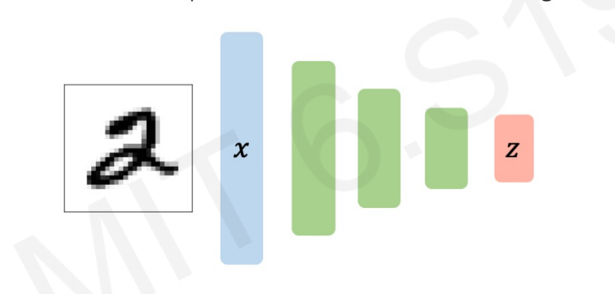
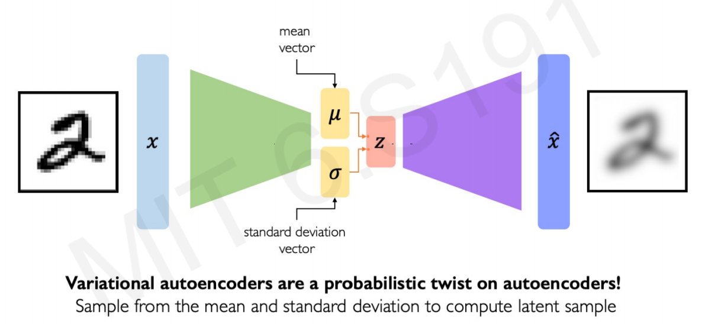
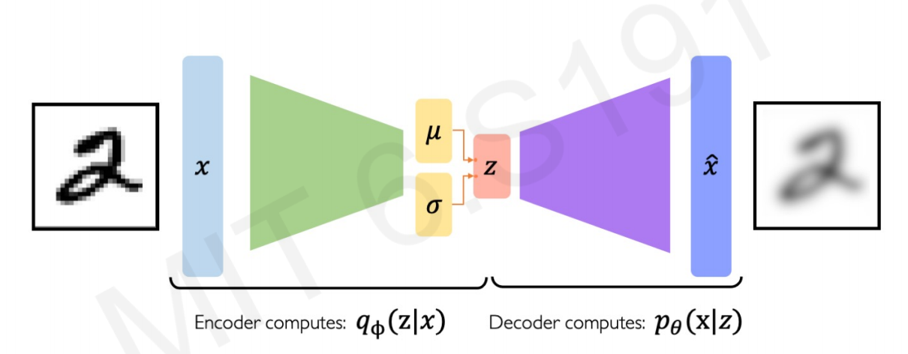
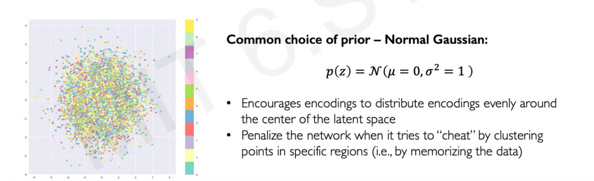
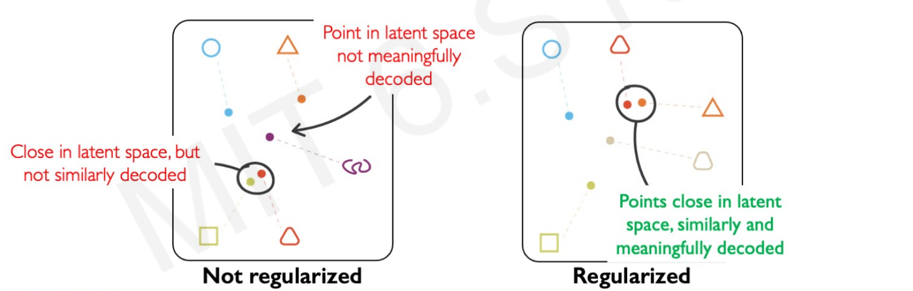
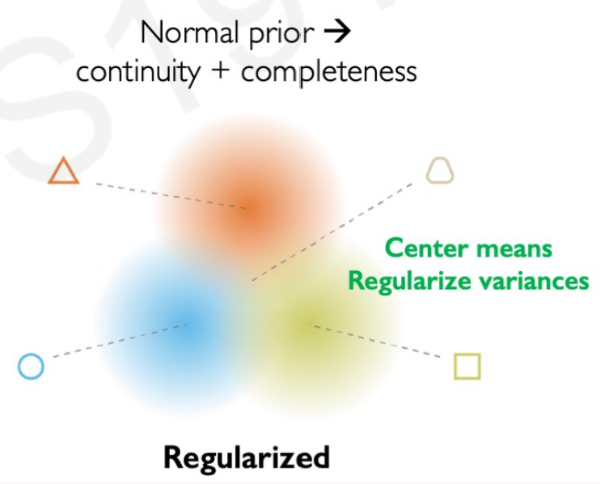
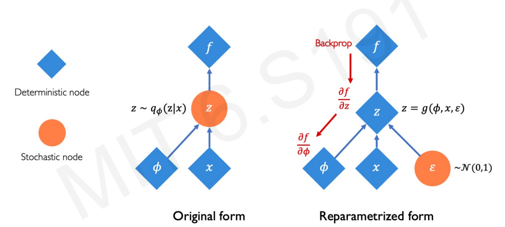
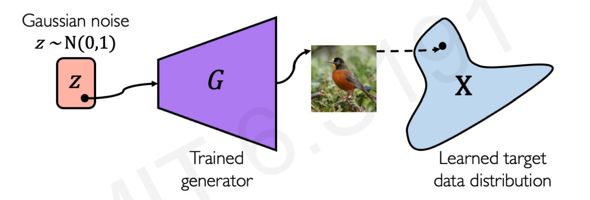
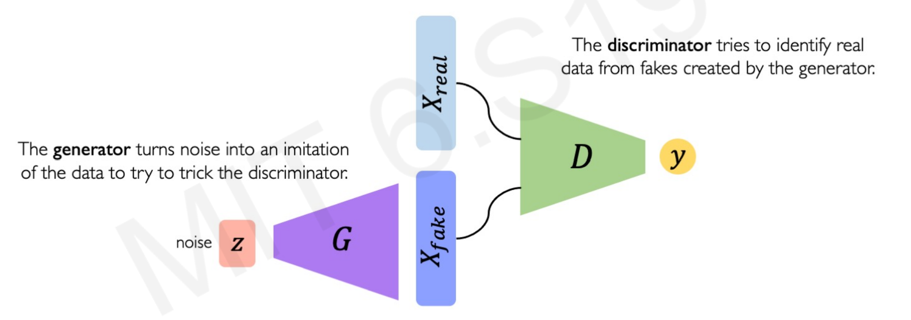

# Generative modeling

Deep Generative Modeling is part of **unsupervised learning: the models receive the data but not the respective labels**. The goal is to take as input the training samples from some distribution and learn a model that represents that distribution.

Another way to define this goal is to **find ways to learn the underlying and hidden latent variables** in the data even when the generative model is only given the representation of the variables.

Deep generative models are very useful to create synthetic samples using the probability density function of the samples provided.

#  Use examples

- Debiasing image recognition

Let's say that you have a silly algorithm that takes facial expressions and the goal is classifying between *pretty* or *non pretty*. However, all your faces are either *white-blond-people smiling at the camera* or portraits of *drug addicts*. This algorithm won't create a boundary between pretty and not, it would define a boundary between white-blond-smiling people and drug users. Generative models can follow the facial distribution of the existing sample to create new samples of portraits with different skin tones, postures and atributes.

- Outlier detection in images

Rare events in tail distributions, such as people crossing the street in red, accidents, or sudden impacts can be created by generative models as samples to train the model of self-driving cars. The benefit is that the car would know what to do in these extreme scenarios even if it hasn't seen it before in the sample.

#  Autoencoding

Autoencoding means **auto**matically **enconding** data. In Generative Modeling, the *Encoder* learns to map from the data $x$ into a low-dimensional vector $z$:

**Autoencoding is a form of compression**. A smaller dimensionality of the latent space means that we can compress the data into smaller latent factors that keep the feature representation.

However, the dimensionality of the latent space will also influence the reconstruction quality. The smaller the latent space the poorer and less quality the generated images have, as will force a larger training to bottleneck.

But wait, the input data has no labeled. Thefore, $z$ cannot be a *feature map* of the atributes of 2s, as this algorithm doesn't know is a 2 in the first place!

**What is this $z$ then?**

**$z$ is vector of latent variables**. It represent the features of the image in a lower dimensional vector space, in this case the features of a 2.

The model uses the features created in this latent space $z$ to construct a new observations $\hat{x}$ following the features of the original $x$. It "decodes" the original images to create new images.

**How the algorithm knows that the atributes in $z$ are right?**

The model learns by comparing the difference between the new synthetic image and the original image in terms of pixels.

Therefore, can be trained to minimize the Mean Squared Error between the sample inputs $x$ and ouput synthetic samples $\hat{x}$.

# Variational Autoencoders (VAEs)

In the previous image, the latent space $z$ acts as a "normal" layer in a Neural Network. Is deterministic in the sense that it would yield the same latent variable space $z$ every time we use the same image as input.

In contrast, **VAEs impose a variational or stochastic** twist to the architecture to generate smoother and different representations of the images:

For each variable, the VAE learns a mean and a variance associated with that latent variable. Instead of using the vector latent variables $z$ straight, the model uses the vector of means and a vector of variances to define the probability distributions for each of the latent variables.

The goal of this twist is to generate slightly different new images from the samples, not to imitate perfectly them perfectly.

# VAE Operations

VAEs optimization process can be dividing into: **encoding and decoding**.

1. **Encoding**.

The first part of the process is called *encoding*, as it encode or define the latent space $z$ given $x$ observations.

Learning the structure of the input images by deconstruction, comparing the differences between the distribution of features input images and new images (log-likelihood). Optimizing the $q_{\phi}$ weights.

2. **Decoding**.

The second part of the process is called *decoding*, as it decodes or extract the features of the latent space $z$ to make new observations $\hat{x}$.

# The VAE regularization

The training phase will change as a result of these two different tasks. The loss function cannot be only calculated as the difference in similarity between input and output images, as they must be different by definition. This is the stochastic *twist* necessary to create new images, not just copies.

The optimization function must include a new term, the **VAE loss:**

**
VAE Loss function = (reconstruction loss) + (regularization term)
**

As in any other neural network, the regularization term avoids overfitting. In this neural network architecture overfitting would mean replicating the same exact images of $x$ into $\hat{x}$. We don't want the same images, we want different images that follows the latent varaibles of the original sample.

By adding this new parameter $D$ to the loss function, the Neural Network will try to reduce not only the errors extracting the latent variables (reconstruction loss) but also avoid overfitting the model so it doesn't create identical copies of the input images (regularization term).

Let's analyze this regularization term analytically: $D\left(q_{\phi}(\mathrm{z} \mid x) \| p(z)\right)$

$D$ is a function of:

- $q_{\phi}(z \mid x)$: the encoding. Imposes to the new synthetic images $\hat{x}$ to follow a inferred latent distribution of the latent variables $z$.

- $p(z)$: the decoding. Imposes to the new synthetic images $\hat{x}$ to follow a prior **fixed prior** distribution of $z$

- Finally, the two vertical lines between the elements of the function is a reciprocal math operator. Effectively, it means that $D$ is function of the difference between the two elements, the **inferrerd** and the **fixed prior** distribution.

In other words, $D$ is a parameter that represents the divergence of what the encoder is trying to infer and a prior distribution of $z$.

The **inferred** distribution of $z$ is easy to understand, as it is just the latent variables of the images created by using the mean and standard deviation of each input.

However...**What is a fixed prior distribution? How it calculates the $p(z)$ ?**

# Priors on the latent distribution

The usual prior distribution choice is the **normal Gaussian distribution** (means equal 0 and standard deviations equals 1). In practical terms, this prior makes the model cut the features that are way out of a normal distribution, such as outliers or edge cases in the data.

The new samples generated $\hat{x}$ follows the inferred distribution but also this fixed prior. The loss funtion optimize the inferred latent distribution and also penalize extreme cases outside the normal distribution (*weird or non-common elements in the images*)

We said that the regularization term *D* is a function of the difference between the inferred latent distribution and a Gaussian prior distribution. This difference is called **KL-divergence**(Kullback-Leibler) or **relative entropy**.

$$
D\left(q_{\phi}(\mathrm{z} \mid x) \| p(z)\right) =-\frac{1}{2} \sum_{j=0}^{k-1}\left(\sigma_{j}+\mu_{j}^{2}-1-\log \sigma_{j}\right)
$$

While the form of the function looks *unfriendly*, it is just a measure of how one probability distribution is different from a second reference probability distribution.

# Why VAE regularization is important?

The VAE regularization  creates:

1. **Continuity**. Data points that are similar in the latent space should result in similar content after the decoding.
2. **Completeness**. New samples out of the latent space should resemble meaningful content after decoding.

Without regularization (a loss function that just tries to minimize the encoding loss), the model could group images that are similar in real life in different clusters because of the small variations. We want input images with close latent features to have very similar distributions that the model can use to create new ones.

The normal prior force the latent learned distribution to overlap. For example, if we want to create faces with VAEs the fixed distribution forces images of faces to place the eyes, mouth, and ears within the same regions.

# VAE Backpropagation: Re-parametrization

Backpropagation in Neural Networks requires deterministic nodes and layers (constant weights). Weights need to remain constant to calculate the chain rule to optimize the loss by gradient descent.

But remember that **VAs impose a variational or stochastic** twist in the forward propagation to generate new images and therefore you cannot backpropagate a sampling layer.

Well, you actually can. The hidden latent space $z$ variation is not stochastic itself, it includes a random constant $\varepsilon$. Therefore, $z$ can be *reparametrized*, as $\varepsilon$ is just a constant that follows a normal distribution.

Notice that $z$ goes from being a stochastic node (left) to being a deterministic one (rigth). Again, this is because $z$ can be derived taking $\varepsilon$ as a random constant that follows a normal distribution. The function loss can be minimized since the chain rule can be applied to optimize the weigths of the encoding loss $q_{\phi}$.

# Generative Adversarial Networks (GANs)

GANs is another architecture to generate new data following the same distribution of the input data. The *Adversarial* part comes because in **this architecture two neural networks contesting with each other in a zero-sum game where one network gain is the other network loss**.

1. **Generator Network**

This network is trained to get random noise data and **produce new (fake) samples that represent the noise distribution** as much as possible. The random noise can be created sample out of a Gaussian distribution.

There are no encoding loss, the new features extracted comes from noise.  Therefore, the distribution that the model is trying to learn comes from a random sampling, not real images.

Here in the next image, the Generator Network $G$ learns from a normal Gaussian distribution $z$ and creates new samples $X_{fake}$ that follows this distribution.

2. **Discriminator Network**

This network takes the fake features from the Generator Network and real features from real images data. With both inputs, **the Discriminator task is to identify the fake features from the real ones**.

*G* tries to synthesize fake instances that fool *D*, and *D* tries to identify these from real ones.

The two networks interact with each other, **the better the Generator Network gets the hardest is for the Discriminator to tell apart** fake from real features.

# GANs Loss

As they have different goals, the Generator and Discriminator network have different loss funtions that combines into a *total* GAN loss funtion.

1. Discriminator Network Loss

$$
\arg \max_{D} \mathbb{E}_{\mathbf{z}, \mathbf{x}}[\log D(G(\mathbf{z}))+\log (1-D(\mathbf{x}))]
$$

It maximizes the probability of the fake data to be identified as fake: $\log D(G(\mathbf{z}))$, and the real data being identified as real: $\log (1-D(\mathbf{x})$.

2. Generator Netowork Loss

$$
\arg \min_{G} \mathbb{E}_{\mathbf{z}, \mathbf{x}}[\log D(G(\mathbf{z}))+\log (1-D(\mathbf{x}))]
$$

It minimizes the probability of the Discriminator Network *D* to identify fake data as fake: $\log D(G(\mathbf{z})$, and the real data being identified as real: $\log (1-D(\mathbf{x}))$.

We can combine both loss functions as the GANs Loss function:

$$
\arg \min_{G} \max_{D} \mathbb{E}_{\mathbf{z}, \mathbf{x}}[\log D(G(\mathbf{z}))+\log (1-D(\mathbf{x}))]
$$
