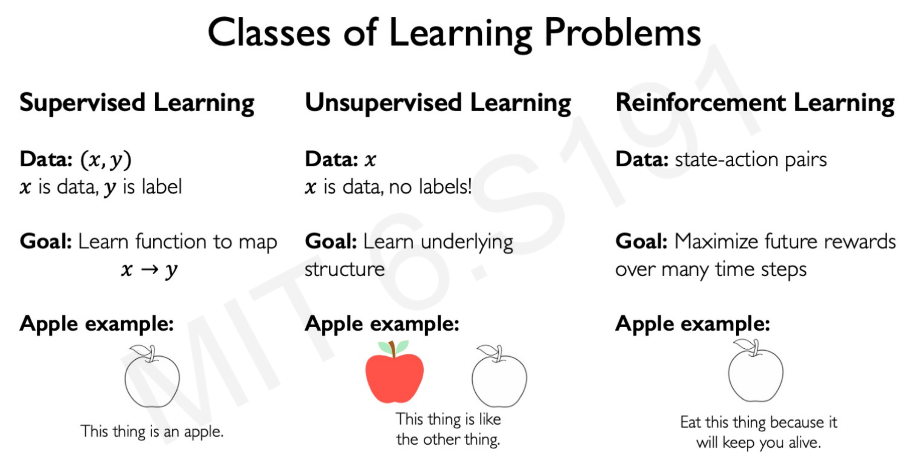

# Reinforced Learning introduction

In Reinforced Learning the data is not a matrix of features and set of targets (supervised learning), neither a matrix of features without targets that an algorithm has to cluster (unsupervised learning). The input data is a state-action pairs.

The algorithm **learns from the consequences of some action in a certain state**. If the action contributes to a reward function, then is encourage and if it doesn't the action is avoided. The **goal** of the algorithm is to maximize the total reward of the agent over time.

The **key concepts** to understand the mechanics of Reinforced Learning are:

- **Actions**: behaviors that the system takes when it sees those states.
- **Agent**: It takes decisions in the environment.
- **Environment**: Where the agent takes action.
- **Action space A**: the set of possible actions an agent can make in the environment.

- **Observations**: who the environment reacts to the agent's actions.
- **State**: a situation which the agent perceives.

- **Reward**: feedback that measures the success or failure of the agent's action.

The **Total Reward** is a function of the sum of rewards through time:

$$
R_{t}=\sum_{i=t}^{\infty} r_{i}=r_{t}+r_{t+1} \ldots+r_{t+n}+\cdots
$$

However, the time of the reward is an important element in the choice of action of the agent. Is not the same $20 today that $20 in 10 years.

The **Discounted Total Reward** is calculated as the sum of rewards through time, times a discount factor between 0 and 1:

$$
R_{t}=\sum_{i=t}^{\infty} \gamma^{i} r_{i}=\gamma^{t} r_{t}+\gamma^{t+1} r_{t+1} \ldots+\gamma^{t+n} r_{t+n}+\cdots
$$

This reward function is also called the *Q-function*.

# The Q-function

The Q-function **captures the expected total future reward** $R$ an agent in the state $s$ can receive by executing a certain action $a$:

$$
Q\left(s_{t}, a_{t}\right)=\mathbb{E}\left[R_{t} \mid s_{t}, a_{t}\right]
$$

When the agent has to decide on an environment, the agent considers the possible Q-functions to compare rewards. The higher the Q-function the better, as the reward is higher. We will call all the possible alternatives *policies*, denoted by ($\pi$), that the algorithm compares.

The optimal policy is inferred by the best action $a$. In formal terms, this represents the **strategy** for the agent. Choosing the optimal policy that maximizes the total discounted future reward:

$$
\pi^{*}(s)=\underset{a}{\operatorname{argmax}} Q(s, a)
$$

Therefore, the agent chooses actions $a$ that maximize the Q-function.

# Deep Q Networks (DQN)

Imagine the following Deep Neural Network in which the state is an Atari videogame and the agent has the actions of moving right or left to destroy the bricks (reward). The goal of the game is to destroy all the bricks using the least possible moves.

The **first solution** that comes to mind is making a Neural Network that iterates over **all the possible state-action pairs** and takes the one that maximizes the expected reward returns.

However, even for this simple environment **the amount of actions $a$ would be enormous**. It would need to calculate the rewards over the time of the entire game, every time it chooses right or left. Every time, for every move $t$, calculating the optimal action. This method to find a strategy is highly inefficient and computationally very expensive.

**A more efficient way to input only the state and let the Neural Network give all the possible set of Q-functions for each action**. Using this method, the Neural Network does not have to compare over Q-functions, it returns all of them for every possible action.

Notice that we don't feed the state, only actions, so the possibilities do not grow exponentially.

The main issue that comes here is how to train this Neural Network. If the Network does not compare between the Q-functions, how it knows which one is better so the model can be trained?

We can introduce a benchmark that the algorithm compares with. A perfect score that the algorithm has to reach by comparing Q-functions. In other words, **Creating a ground-truth Q-target**. Therefore, the distance with this perfect Q-target is our loss function (MSE) to train the Neural Network:

$$
\mathcal{L}=\mathbb{E}[\| \overbrace{\left(r+\gamma \max_{a \prime} Q\left(s^{\prime}, a^{\prime}\right)\right.}^{\text {target }})-\overbrace{\left.Q(s, a) \|^{2}\right]}^{\text {predicted }}
$$

The Network predicts state-action pairs $Q(s,a_{n})$ that closes the Q-target as much as possible. The better match with the target function, the smaller is the loss and the better is the policy.

Going back to the **Atari example**:

For a given state $s_t$ the ball is coming towards the slider. The Neural Network creates 3 Q-functions: one for the slider going left, one for the slider staying, and one for the slider going right.

The action $a_1$ (slider to the left) has a better payoff reward, so the optimal policy $\pi$ or strategy for this state $s_t$ is going left.

Then it stats over for the state $s_{t+1}$.

# Downsides of Q-Learning

- Complexity

**The models can only use scenarios where the action space is discrete and small**. That is why Q-learning is so popular in video games because is a controlled environment with a limited set of actions. As an example of a continuous and infinite space, consider a driving car with the possibility to go towards any direction (infinite angles of directions).

- Flexibility

The optimal policy is **deterministically computed from the Q-function** by maximizing the reward. It cannot compute the reward of any distribution of data outside de range of possible environment scenarios.  It cannot learn stochastic policies that might get better rewards.

# Policy Learning

Until now, we were taking the state as fixed and looking for the best set of actions that maximizes the rewards. The algorithm learns using the possible actions. Instead of optimizing for actions, we can optimize for policies.

The difference is subtle but important. To illustrate we go back to the **Atari example**:

The Neural Network does not compare actions, it compares the probability of the actions being the correct and sample from that. In this Atari example, going left has a 90% probability of reaching the optimal policy. Therefore, the algorithm choose $a_1$ (slider left) 90% of the time, $a_2$ (center) 10% of the time and $a_3$ (right) 0% of the time. The probabilities sum to 1. This is called **Policy gradient**, as it directly optimizes the policy without calculating the rewards.

**What advantages has Policy Learning over Q-Learning?**

With policy learning, the models can handle continuous spaces. We can calculate not only the left or right (discrete choice) but the speed of the slider (continuous choice). For example, the slider can go 1 meter, 2 meters, or 20 meters to the left. Each continuous set of actions has attached a probability of being the best policy.

In the following image, the highest probability action is going to the -1 meters/second in a continuous probability space with many other rates:

From this probability, the optimal policy derived is going -0.8 meters/second, taking into account the variance.

This opens the possibility of computing in environments in which the actions are continuous like autonomous vehicles.

# Policy Learning Gradients

The loss function is calculated by multiplying 2 terms: the probability of an action given the state, and the reward attached to that action. These elements are captured by the negative log-likelihood of the policy ($-log P(a_t|a_s)$) and the total discounted returns ($R_t$).

$$
\mathcal{L}= -log P(a_t|a_s)R_t
$$

The algorithm wants to minimize this loss function as much as possible. Therefore, the larger the probability of the policy and the reward, the more negative is the loss function.

Also, it amplifies the actions with high reward but low probability, and low reward but a high probability of happening.

The gradient descent or weight updating of the neural network works like in the vanilla neural network gradient descent: computes the gradient and updates the weights according to the direction of the gradient. As we said, the gradient descent is made with respect to the policy, not the actions:

$$
w' = w - \nabla\mathcal{L}
$$

$$
w' = w + \nabla \underbrace{\log P(a_t|a_s)R_t}_\text{Policy gradient}
$$

Notice that by using the **negative** log-likelihood instead of positive, it turns the weight updating to positive. Hence, the network weighs more the set of actions with a combination of high probability/high reward.
