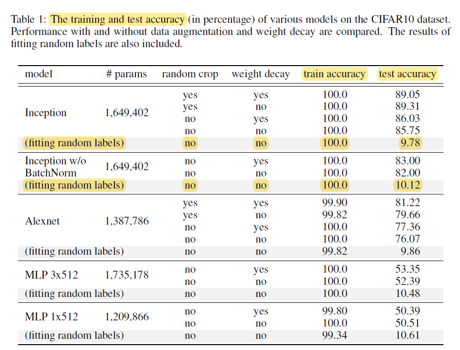
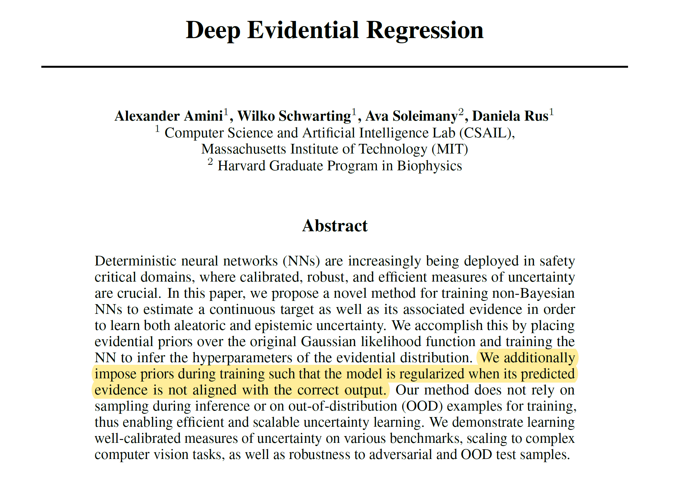

# Introduction

The rise and hype of Deep Learning led to the general public to see Machine Learning, Deep Learning, and the whole AI field like some kind of **alchemy**. Any problem in which we have data can be solved by AI. The reality is that only very specific problems can be solved by AI, and feeding poor data in a random network architecture will produce no value at all.

**What Deep Learning is good at?**

Deep Neural Networks are extremely good at finding a pattern **in the existing data**. A recent paper by Google Brain/Deepmind researchers[^1] shows that a neural network can be 100% accurate fed **by random label images**:

A model is as good as the data you feed it. If you tell train a model to see a banana image and a tree image as a dog, every time that the model sees **that exact images** it will correctly classify them. The problem comes when it sees other banans or tree images. The accuracy could be 100% in the training set and has close-to-random accuracy in the test set.

The model overfitted the specific images to the specific label and has **no generalization power** to predict new unseen data. **Without generalization, any neural network is worthless.** They can approximate any seen distribution, but how do we know what and how it is going to predict in unseen data?

# Limitations: Uncertainty

Part of the new frontiers in AI tries to solve **the problem of uncertainty**. Or how to make models that infer the right choice when it faces data that it has not being trained to interact with. For example, this is especially important in the field of autonomous vehicles, in which a change in the construction of a road can lead to terrible results:

Autonomous cars should be able to identify this **uncertainty** or unseen state of the road and not crash the car, even if the car is being trained to go in that direction.

Let's take the classical toy model of **classifying an image of a dog vs cat**. The model takes only inputs of cat and dog images and returns the probability of being a cat vs a dog. What happens if we ask the model to predict an image of a dog and a cat together? What happens if we ask the model to predict the probability of a cat/dog feeding the image of a horse?

By definition, **the model gives just the probability of dog and cat**. It cannot output the probability of random data or the confidence in that prediction.

We need an uncertainty metric to assess the noise inherent to the data (*aleatoric uncertainty*) and to **assess the network's confidence** in its predictions (*epistemic uncertainty*).

# Frontiers: Evidential Neural Networks

New reseach[^2] using *adversarial attacks* tries to introduce perturbations into the data so the networks it is **not only optimized by modifying the weights but also optimized by modifying the input images**. Given an input, the network is trained to predict the parameters of what they called an evidential distribution.

The network can model a higher-order probability distribution over the individual likelihood parameters. Taking the cat/dog model example, this means that a network trained with photos of cats and dogs and fed with a horse image can output
cat probability of 0 and a dog probability of 0.

Evidential regression simultaneously learns a continuous target along with aleatoric
uncertainty from the data and epistemic uncertainty from the model.

# Frontiers: Automated Machine Learning

Standard deep neural networks are optimized **for a single task**. It often requires expert knowledge to build an architecture for any task. What if we could build a learning algorithm or system that **learns which model** to use to solve a given problem?

Automated Machine Learning (AutoML) is a growing field of AI[^3] that uses autodetection of network architectures, so it relies less on human choice and expertise as it learns the model architectures directly on the dataset of interest.

The **concept** of this method is simple to understand. It is a system **has a *controller network* and a *child network***. The controller samples an initial architecture and the child uses that architecture in a dataset. For every architecture sample, the child network gets an accuracy value that is used to update the controller.

The better the architecture and parameters proposed by the controller is, the better the results of the child network, and the more the controller knows is getting good architecture proposals.

This last step is key. **How the controller learns?**

The controller is a Recurrent Neural Network, with *N* layers corresponding to different architectures and parameters to choose from. One layer represents a combination of model/parameters to try.

1. The controller samples these different networks with a parametrization.
2. The controller feed variations to the child network.
3. The child produces an accuracy *R* that is used to train the weights of the controller.
4. Once it has the best parameter, the one with better accuracy in the child network, that layer is optimized and jumps to the next one.
5. Repeat until all the layers (parameters) converge.

While AutoML can be seen as a shortcut, **this system can produce state-of-the-art results**[^3] in image recognition, getting better results and being more efficient than human-created network architectures:

*NASNet* stands for *Neural Architecture Search Network*

[^1]: C. Zhang et al. (2016) - Understanding deep learning requires rethinking generalization: https://arxiv.org/abs/1611.03530
[^2]: A Amini et al. (2019) - Deep Evidential Regression: https://arxiv.org/abs/1910.02600
[^3]: B. Zoph (2017) - Learning Transferable Architectures for Scalable Image Recognition: https://arxiv.org/abs/1707.07012
